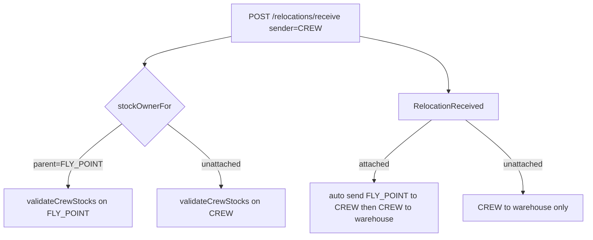
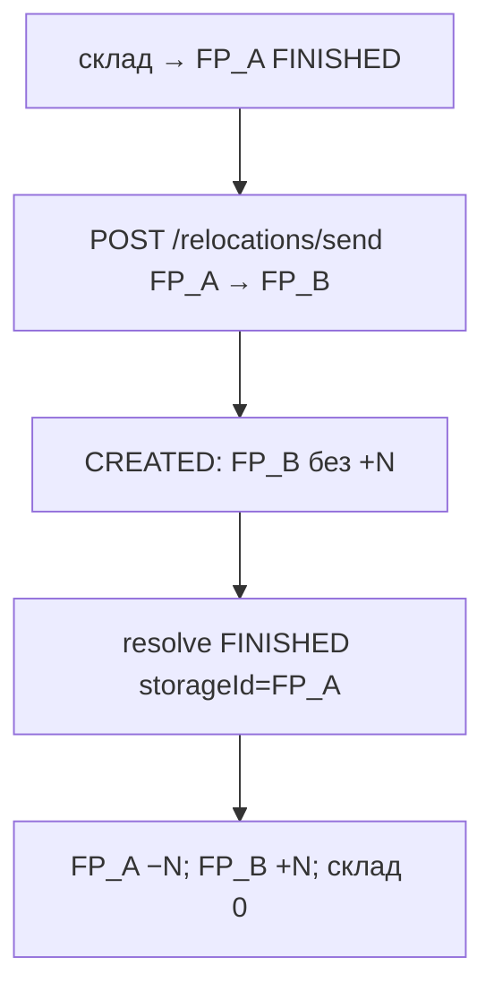

# REQ-CREW-002 — Видача та повернення CREW/FLY

Документація фічі для команди QA / продукту / автотестів.  
TCM feature: **REQ-CREW-002** «Видача та повернення CREW/FLY» (модуль CREW, parent `REQ-CREW`) — **повна documentation у TCM**.  
Дзеркало в репо: `docs/REQ-CREW-002-crew-fly-issuance-return.md`.  
SUT: backend `tk`, frontend `tk-ui`. Автотести: `erp-auto-test`.

Суміжні фічі (не дублювати тут повністю):

| Feature | Що дає цій фічі |
|---------|-----------------|
| `REQ-CREW-003` | Інвентаризація / звіти STOCK·INCOME CREW/FLY (окремий doc) |
| `REQ-WMS-008` | Інциденти на видачі CREW/FP |
| `REQ-REGION-002` | CREWS region / видимість локацій |

---

## 1. Огляд

Фіча покриває **три напрямки** переміщень ресурсів між складом локації та CREW / FLY_POINT:

1. **Видача** (UNIT/склад → CREW або FLY_POINT) — send → CREATED → FINISHED / AUTO_FINISHED; для attached CREW — auto-forward на FLY_POINT.
2. **Повернення** (CPMA-647) — отримання від екіпажу назад на склад локації через `POST /relocations/receive` з `senderId` = CREW.
3. **Передача між точками зльоту** (AC-23) — `POST /relocations/send` з `senderId`/`recipientId` = дві різні FLY_POINT; CREATED → FINISHED відправником (точка-відправник).

Цей документ детально описує **повернення (AC-22)** і **передачу FP→FP (AC-23)**. Видача (AC-01…AC-21) — у TCM acceptance criteria тієї ж фічі; автотести: `CrewRelocationTest`, `FlyPointRelocationTest`, `FlyPointToFlyPointRelocationTest`, `CrewIssuanceUITest`, `FlyPointToFlyPointIssuanceUiTest`.

### 1.1. Терміни

| Термін | Значення |
|--------|----------|
| **CREW** | `UnitType.CREW` — склад екіпажу |
| **FLY_POINT** | `UnitType.FLY_POINT` — точка вильоту |
| **Unattached CREW** | Parent ≠ FLY_POINT; залишок на shelf екіпажу |
| **Attached CREW** | Parent = FLY_POINT; операційний залишок на точці (після auto-forward) |
| **Receive / повернення** | `POST /api/v1/relocations/receive`, sender = CREW, recipient = склад локації |
| **CREWS region** | `accessMode=CREWS` — membership + locations для кнопок UI |

### 1.2. Типова ієрархія (fixtures)

```text
UNIT
├── FLY_POINT_A             ← prepareTwoFlyPointsScenario (sender)
├── FLY_POINT_B             ← prepareTwoFlyPointsScenario (recipient)
├── FLY_POINT
│   └── CREW (attached)     ← prepareAttachedCrewScenario
└── CREW (unattached)       ← prepareSingleCrewScenario
```

---

## 2. Повернення (CPMA-647) — AC-22

### 2.1. Бізнес-правила

1. Повернути можна **не більше**, ніж є на залишку точки (attached) або екіпажу (unattached).
2. **Attached:** при списанні створюється переміщення FLY_POINT → CREW, потім CREW → склад локації.
3. **Unattached:** створюється переміщення CREW → склад локації.
4. Право оформлювати: `relocation::create` на **recipient** (склад локації); UI — кнопка «Отримати від екіпажа» при `hasCrews` і не «Всі локації».



### 2.2. API

| Метод | Path | Enum | Примітка |
|-------|------|------|----------|
| POST | `/api/v1/relocations/receive` | `RELOCATION_POST_RECEIVE` | multipart; sender=CREW або EXTERNAL SUPPLIER |
| GET | `/api/v1/storages/names/crew-units` | `STORAGE_GET_CREW_UNITS` | UI: каскад підрозділ |
| GET | `/api/v1/storages/names/crews` | `STORAGE_GET_CREW_NAMES` | UI: список екіпажів |

SUT (read-only):

- `RelocationValidator.validateCreateReceive` + `stockOwnerFor` + `validateCrewStocks`
- `FlyPointFacade.onRelocationReceived` — ланцюг для attached
- `RelocationController`: `@PreAuthorize` на `recipientId` + `relocation::create`

Fixture helpers: `RelocationFixture.createCrewReceive` / `tryCrewReceive`, `RelocationDataFactory.buildCrewReceiveRequest`.

### 2.3. UI

| Елемент | Значення |
|---------|----------|
| CTA журналу | «Отримати від екіпажа» → `/relocation/create-input-crew` |
| h1 форми | «Отримання від екіпажа» |
| Поля | Підрозділ → Екіпаж → ресурс (Autocomplete) → кількість → Підтвердити |
| Після submit | AUTO_FINISHED → вкладка «Отримано» |

Page objects: `RelocationPage.clickReceiveFromCrew()`, `RelocationCreateInputCrewPage`.

Та сама форма для unattached і attached — різниця лише в backend stock (FP vs CREW).

### 2.4. Acceptance Criteria — AC-22

**TCM:** Повернення від екіпажу на склад (CPMA-647): `POST /relocations/receive` з sender=CREW; amount ≤ stock (CREW або FLY_POINT для attached); unattached — CREW→склад; attached — ланцюг FLY_POINT→CREW→склад.

| TestCaseId | Клас / метод | Суть |
|------------|--------------|------|
| TC-CREW-RET-001 | `CrewReturnTest.unattachedCrewReturnDebitsCrewCreditsWarehouse` | API unattached: CREW −N, warehouse +N |
| TC-CREW-RET-002 | `CrewReturnTest.attachedCrewReturnDebitsFlyPointCreditsWarehouse` | API attached: FP −N, warehouse +N, CREW ≈ 0 |
| TC-CREW-RET-003 | `CrewReturnTest.unattachedCrewReturnOverStockRejected` | amount > CREW stock → 400 |
| TC-CREW-RET-004 | `CrewReturnTest.attachedCrewReturnOverStockOnFlyPointRejected` | amount > FP stock → 400 |
| TC-UI-CREW-RET-001 | `CrewReturnUITest.receiveFromCrewButtonVisible` | CTA видима |
| TC-UI-CREW-RET-002 | `CrewReturnUITest.happyPathUnattachedCrewReturn` | UI unattached + stock |
| TC-UI-CREW-RET-003 | `CrewReturnUITest.happyPathAttachedCrewReturnDebitsFlyPoint` | UI attached + FP debit |

---

## 3. Видача (коротко)

AC-01…AC-21 — видача UNIT→CREW/FLY, journal, RBAC, UI «Видати на екіпаж», інциденти, видимість імен.  
Автотести: `CrewRelocationTest`, `FlyPointRelocationTest`, `CrewFlyPointIncidentTest`, `CrewIssuanceUITest`, `CrewJournalNameVisibilityUiTest`.  
Деталі критеріїв — у TCM під тим самим `REQ-CREW-002`.

---

## 3.1. Передача між точками зльоту — AC-23

### 3.1.1. Бізнес-правила

1. Sender і recipient — **різні** `FLY_POINT`. З точки вильоту не можна видати на UNIT або CREW (`relocation.send.flyPointRecipientOnly`).
2. Caller має мати `relocation::{recipient}::create` (точки з CREWS-області користувача).
3. Lifecycle як UNIT→FP: **CREATED**, отримувач без зарахування, поки відправник не зробить **FINISHED** (`resolve` з `storageId` = FP_A). CREW↔FP — єдиний випадок без підтвердження.
4. Stock: спочатку засіяти FP_A видачею склад→FP_A. Після FINISHED: FP_A −N, FP_B +N, склад локації без змін.



### 3.1.2. API

| Метод | Path | Enum | Примітка |
|-------|------|------|----------|
| POST | `/api/v1/relocations/send` | `RELOCATION_POST_SEND` | `senderId`/`recipientId` = дві FLY_POINT |
| PUT | `/api/v1/relocations/{id}/resolve` | resolve FINISHED | `storageId` = точка-відправник |

SUT (read-only):

- `RelocationValidator#validateFlyPointHandout` — recipient має бути FLY_POINT + `relocation::create`
- `RelocationUtil#requiresDeliveryConfirmation` — true для FP→FP (не CREW↔FP)
- UI submit: той самий `relocationsApi.send`

Fixture: `CrewRegionFixture.prepareTwoFlyPointsScenario`, `RelocationFixture.createSend` / `createSendAndFinishBySender` / `resolve`.

### 3.1.3. UI

| Елемент | Значення |
|---------|----------|
| CTA журналу | «Видати між точками зльоту» → `/relocation/create-output-fly-point` |
| Умова CTA | `canRelocate && hasCrews`; прихована для «Всі локації» |
| h1 форми | «Видача між точками зльоту» |
| Поля | «Точка зльоту (звідки)» / «(куди)» (обов’язково різні), ресурс зі stock FP_A, кількість, видавець, Підтвердити |
| Після submit | CREATED → вкладка «В дорозі» |

Page objects: `RelocationPage.clickIssueBetweenFlyPoints()`, `RelocationCreateOutputFlyPointPage`.

Опції combobox: `GET /storages/names/crew-units` (лістинг включає FLY_POINT без CREW); підпис `unit / fpName`.

### 3.1.4. Acceptance Criteria — AC-23

**TCM:** Передача FLY_POINT→FLY_POINT: send → CREATED → FINISHED відправником; FP_A −N, FP_B +N, склад без змін. FLY_POINT → UNIT/CREW заборонено.

| TestCaseId | Клас / метод | Суть |
|------------|--------------|------|
| TC-FLY-FP-001 | `FlyPointToFlyPointRelocationTest.testSendBetweenFlyPointsCreatedThenFinishedBySender` | API happy: CREATED, потім FP_A −N / FP_B +N |
| TC-FLY-FP-002 | `FlyPointToFlyPointRelocationTest.testSendFromFlyPointToUnitOrCrewRejected` | API negative: FP→UNIT і FP→CREW → 4xx |
| TC-UI-FLY-FP-001 | `FlyPointToFlyPointIssuanceUiTest.testIssueBetweenFlyPointsButtonVisible` | CTA видима |
| TC-UI-FLY-FP-002 | `FlyPointToFlyPointIssuanceUiTest.testHappyPathFlyPointToFlyPointIssuance` | UI форма + stock |
| TC-UI-FLY-FP-003 | `FlyPointToFlyPointIssuanceUiTest.testIssueBetweenFlyPointsHiddenForAllLocations` | «Всі локації» ховає CTA |

---

## 4. Як ганяти

```bash
# API повернення
mvn test -Denv=staging -Dtest=CrewReturnTest

# UI повернення
mvn test -Denv=staging -Dtest=CrewReturnUITest

# API передача між точками зльоту
mvn test -Denv=dev -Dtest=FlyPointToFlyPointRelocationTest

# UI передача між точками зльоту
mvn test -Denv=dev -Dtest=FlyPointToFlyPointIssuanceUiTest

# Обидва
mvn test -Denv=staging -Dtest=CrewReturnTest,CrewReturnUITest
```

Suites: `relocations.xml`, `functional.xml`, `storage-regions.xml`, `regression.xml`, `ui-dev.xml`.

**Staging:** cleanup локацій/областей зазвичай пропускається — для UI autocomplete шукати ресурс за унікальним суфіксом імені (див. `RelocationCreateInputCrewPage.selectResourceByName`).

---

## 5. Посилання на код SUT (read-only)

| Компонент | Шлях |
|-----------|------|
| Validate receive + crew stock | `tk` … `RelocationValidator#validateCreateReceive` |
| Attached chain on receive | `tk` … `FlyPointFacade#onRelocationReceived` |
| Receive endpoint | `tk` … `RelocationController` POST `/receive` |
| UI форма повернення | `tk-ui` … `RelocationCreateInputCrewPage.tsx` |
| UI CTA повернення | `tk-ui` … `RelocationPage.tsx` («Отримати від екіпажа») |
| Validate FP→FP send | `tk` … `RelocationValidator#validateFlyPointHandout` |
| UI форма FP→FP | `tk-ui` … `RelocationCreateOutputFlyPointPage.tsx` / `RelocationOutputBetweenFlyPointsForm.tsx` |
| UI CTA FP→FP | `tk-ui` … `RelocationPage.tsx` («Видати між точками зльоту») |

З `erp-auto-test` **не** редагувати `tk` / `tk-ui` (див. `.cursor/rules/sut-no-modify.mdc`).

---

## 6. Історія змін документа

| Дата | Зміна |
|------|--------|
| 2026-07-27 | Перша версія: фокус AC-22 повернення CPMA-647; карта TC API/UI; дзеркало TCM |
| 2026-09-05 | AC-23: передача FLY_POINT→FLY_POINT (API + UI + карта TC) |
