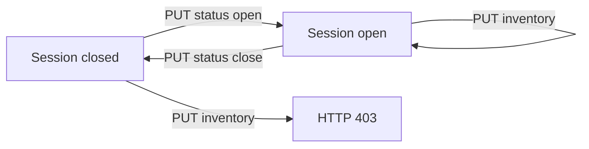
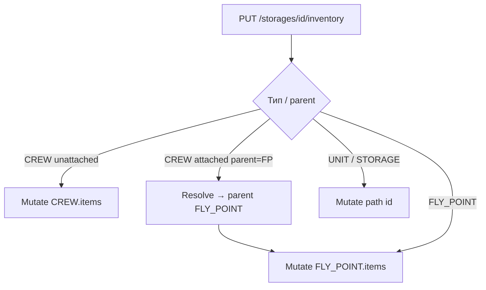
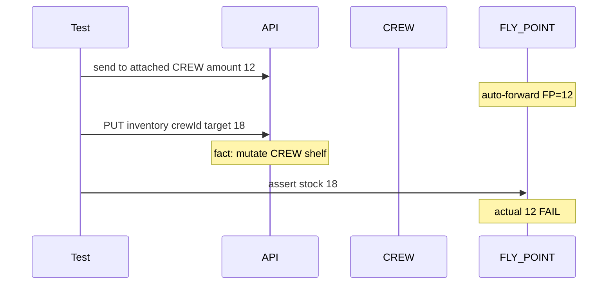
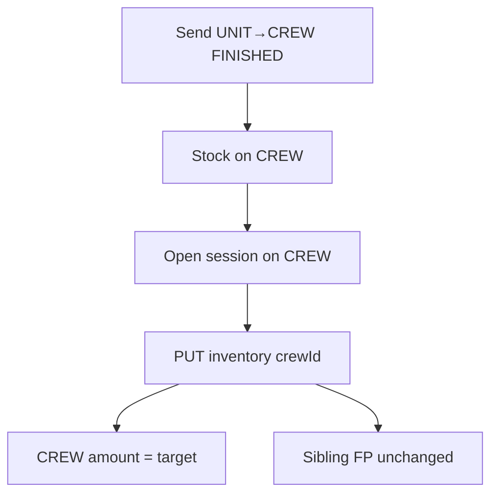
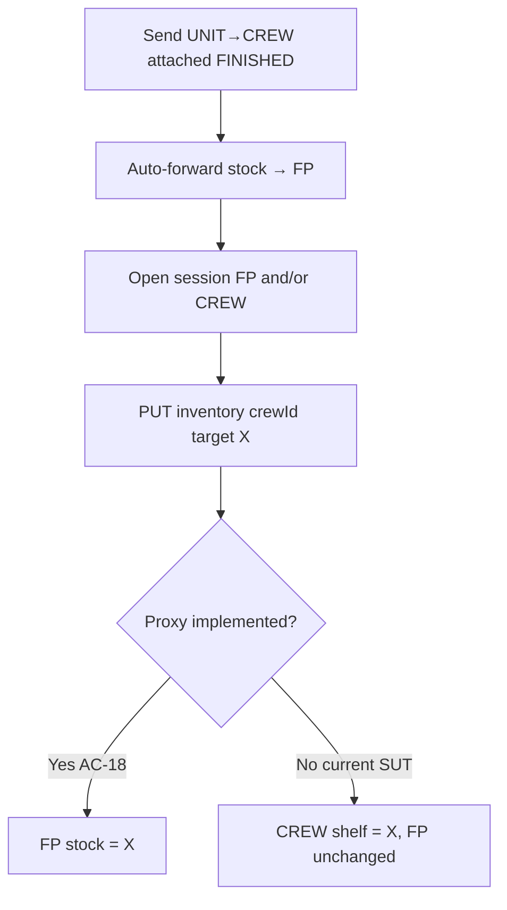
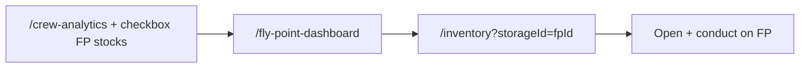

# REQ-CREW-003 — Інвентаризація екіпажів та точок вильоту

Документація фічі для команди QA / продукту / автотестів.  
TCM feature: **REQ-CREW-003** «Звіти, залишки та інвентаризація CREW/FLY» (модуль CREW, parent `REQ-CREW`, priority HIGH) — **повна documentation у TCM**.  
Дзеркало в репо: `docs/REQ-CREW-003-crew-fly-inventory.md`.  
SUT: backend `tk`, frontend `tk-ui`. Автотести: `erp-auto-test`.

Суміжні фічі (не дублювати тут повністю):

| Feature | Що дає цій фічі |
|---------|-----------------|
| `REQ-CREW-002` | Видача UNIT→CREW / FLY_POINT, auto-forward, journal |
| `REQ-REGION-002` | RESOURCES scope для autocomplete / PUT guard |
| `REQ-WMS-003` / `REQ-WMS-007` | Загальний UNIT inventory session (той самий API path) |
| `REQ-WMS-008` | Інциденти на видачі CREW/FP (окремий doc) |

---

## 1. Огляд

**Інвентаризація CREW / FLY_POINT** — проведення фактичних залишків на складах типу **екіпаж** і **точка вильоту**:

1. Відкрити сесію інвентаризації (`inventory/status` → open).
2. Зчитати поточні залишки (`GET …/inventory`).
3. Записати цільові кількості (`PUT …/inventory`).
4. Закрити сесію.

Окремо від session-conduct фіча включає:

- звіти **STOCK** / **INCOME** по екіпажах (`GET /storages/inventory/crews`);
- UI-вхід з **аналітики екіпажів** і **дашборду точок вильоту**;
- суміжні write-off / FAITA usage (списання з точки, не session PUT).

У розмовній мові «точка видачі» = **FLY_POINT** (точка вильоту / точка взльоту в UI).

### 1.1. Терміни

| Термін | Значення |
|--------|----------|
| **CREW** | `UnitType.CREW` — склад екіпажу |
| **FLY_POINT** | `UnitType.FLY_POINT` — точка вильоту |
| **Unattached CREW** | Parent = UNIT (або інший не-FP); екіпаж має власний shelf |
| **Attached CREW** | Parent = FLY_POINT; операційний залишок живе на точці |
| **Inventory session** | Прапорець `isInventoryOpen` на storage; без open PUT → 403 |
| **Auto-forward** | Після FINISHED (або AUTO_FINISHED) видачі на attached CREW stock зараховується на FLY_POINT; CREW ≈ 0 |
| **Proxy (цільовий контракт)** | PUT `/storages/{crewId}/inventory` для attached CREW **має** мутувати parent FLY_POINT |
| **CREWS region** | Область видимості `accessMode=CREWS` (локації UNIT/FP/CREW + members) |
| **Crew-Manager** | Роль з `inventory-list::{crew}::read` / правами conduct на екіпажі (`UserRole.CREW_MANAGER`, username `argument` у конфігу) |

### 1.2. Ієрархія локацій (типові fixture)

```text
UNIT (батьківський підрозділ)
├── FLY_POINT (точка вильоту)          ← prepareFlyPointScenario / частина attached
│   └── CREW (attached)               ← prepareAttachedCrewScenario
└── CREW (unattached)                 ← prepareSingleCrewScenario
```

`CrewRegionFixture` створює CREWS region на UNIT, додає locations (unit, fp, crew) і members (OWNER_1 storage тощо).

### 1.3. Життєвий цикл сесії



Правило однакове для UNIT, CREW і FLY_POINT. Для attached proxy (AC-18) цільова сесія — на **FLY_POINT** (і/або на CREW id у URL, якщо API проксує).

---

## 2. API

### 2.1. Endpoints інвентаризації

| Метод | Path | Enum у фреймворці | Призначення |
|-------|------|-------------------|-------------|
| GET | `/api/v1/storages/{id}/inventory` | `STORAGE_INVENTORY_GET` | Залишки складу |
| PUT | `/api/v1/storages/{id}/inventory` | `STORAGE_INVENTORY_PUT` | Проведення (`InventoryRequest`: список `resourceId` + `amount`) |
| GET | `/api/v1/storages/{id}/inventory/status` | `STORAGE_INVENTORY_STATUS_GET` | `{ open, hasCrews, … }` |
| PUT | `/api/v1/storages/{id}/inventory/status` | `STORAGE_INVENTORY_STATUS_PUT` | Open / close (`InventorySessionStatus`) |
| GET | `/api/v1/storages/inventory` (multi-location query) | `STORAGE_INVENTORY_MULTI_GET` | Агрегат по кількох локаціях |
| GET | `/api/v1/storages/inventory/crews?requestType=STOCK\|INCOME` | `STORAGE_GET_CREW_INVENTORY` | Звіт залишків / надходжень по CREW |

Типовий UI-query для GET inventory (як у тестах): pagination + sort (`size`, `page`, `searchTerm`, `sort`).

### 2.2. Write-off (суміжно)

| Метод | Path | Enum | Призначення |
|-------|------|------|-------------|
| GET | `/api/v1/storages/inventory/write-off` | `INVENTORY_WRITE_OFF_GET_PAGE` | Сторінка reconciliation |
| GET | `…/write-off/short-stats` | `INVENTORY_WRITE_OFF_GET_SHORT_STATS` | Contract probe |
| PUT | `…/write-off/complete` | `INVENTORY_WRITE_OFF_PUT_COMPLETE` | Complete → debit stock |
| PUT | `…/write-off/reject` | `INVENTORY_WRITE_OFF_PUT_REJECT` | Reject |

**Важливо:** write-off для attached CREW **вже** резолвить target storage на parent FLY_POINT:

```text
InventoryWriteOffService.getInventoryStorage:
  CREW + parent FLY_POINT → debit flyPoint
  інакше → debit writeOffEntry.storage
```

Inventory PUT (`StorageItemFacade.inventory`) такого resolve **немає** — див. §5 AC-18.

### 2.3. Тіло PUT inventory

Автотести через `InventoryFixture.setResourceAmount`:

1. `GET` поточний список items складу.
2. `InventoryDataFactory.mergeWithExisting(items, Map.of(resourceId, targetAmount))` — повний snapshot з оновленою кількістю.
3. `PUT` з цим тілом.

Тобто клієнтський контракт — **повний список ресурсів**, не «дельта одного поля» (як у UI формі проведення).

### 2.4. RBAC (ролі в автотестах)

Конфіг: `UserRole.ADMIN`, `OWNER_1` (alkatras), `OWNER_2` (bar), `CREW_MANAGER` (argument).

| Дія | ADMIN | OWNER_1 у CREWS | Crew-Manager | OWNER_2 / outsider |
|-----|-------|-----------------|--------------|---------------------|
| GET `/inventory/crews` STOCK/INCOME | ✓ | ✓ (своя область) | ✓ | обмежено / порожньо |
| GET `/storages/{crew}/inventory` | ✓ | часто **403** без `inventory-list::{crew}` (див. AC-04) | ✓ | 403/404 |
| GET `/storages/{fp}/inventory` | ✓ | за BU / region | за grants | 403 |
| PUT status open/close | ✓ | OWNER_2 на чужий CREW — ✗ | ✓ (CREWS) | 403 |
| PUT inventory (open) | ✓ | за правами | ✓ | 403 |

Деталі — AC-04…07, AC-21 і відповідні TC.

---

## 3. UI

### 3.1. Актуальні шляхи (після CPMA-636)

| Сценарій | Кроки користувача | Цільовий storageId |
|----------|-------------------|--------------------|
| Unattached CREW | `/crew-analytics` → «Залишки на екіпажах» → клік по екіпажу | `crewId` |
| Attached CREW | Той самий екран + checkbox «Враховувати залишки на точках взльоту» → рядок веде на `/fly-point-dashboard` → інвентаризація точки | `flyPointId` |
| Deep-link | `/inventory?storageId={id}` або `/inventory/{id}` | id у URL |

Page objects: `CrewAnalyticsPage`, `FlyPointDashboardPage`, `InventoryEditPage`.

### 3.2. Deprecated UI

| Шлях | Статус | Заміна |
|------|--------|--------|
| `/unit-management?mode=crews` | DEPRECATED (CPMA-636) | AC-19/20, TC-UI-CREW-015…018 |
| TC-UI-CREW-004 / 010 / 011 | TCM status DEPRECATED | не regression-primary |

Тест TC-UI-CREW-021 лише перевіряє, що старий URL **не падає**.

### 3.3. Обмеження UI

| Правило | Очікування | TC |
|---------|------------|-----|
| «Всі локації» | Session toggle / conduct disabled | TC-UI-CREW-024 |
| CREW/FP у workspace picker | Відсутні | TC-UI-CREW-020 |
| Без `inventory-status` | Немає Open/Close | TC-UI-CREW-022, TC-UI-FLY-INV-004 |
| Без прав conduct | Немає «Провести» / disabled при closed | TC-UI-CREW-023 |
| Closed session | Conduct disabled | TC-UI-FLY-INV-004 |
| Attached deep-link на crewId | Порожній / forwarded UX (не окремий «склад екіпажу») | TC-UI-CREW-019 |
| Autocomplete на FP | Scope = UNIT ancestor RESOURCES | TC-UI-STR-RES-013 |

---

## 4. Правила stock (цільовий контракт)

### 4.1. Матриця ефектів

| Сценарій | Хто в URL | Де змінюється stock (ціль) |
|----------|-----------|----------------------------|
| Unattached CREW PUT | `crewId` | **CREW** |
| Unattached + sibling FP | PUT на crew | Sibling **FP без змін** |
| Attached CREW PUT | `crewId` | **FLY_POINT** (proxy) |
| Прямий PUT на точку | `flyPointId` | **FLY_POINT** |
| Issue UNIT→attached CREW FINISHED | — | Auto-forward → **FP**; CREW ≈ 0 |
| Issue UNIT→unattached CREW FINISHED | — | **CREW** |
| Reparent / attach CREW→FP зі stock | — | Stock переїжджає на **FP** |
| Write-off complete (attached) | write-off storage=CREW | Debit **FP** (уже реалізовано) |

### 4.2. Діаграма цільового PUT



### 4.3. RESOURCES scope

Для CREW і FLY_POINT область видимості ресурсів = **перший предок**, що не є CREW і не є FLY_POINT (зазвичай UNIT з `accessMode=REGIONS` + область RESOURCES).

| Перевірка | TC |
|-----------|-----|
| Autocomplete FLY_POINT = grants UNIT ancestor | TC-STR-RES / suite include `testFlyPointAutocompleteInheritsUnitAncestorResources` |
| CREW under FP: skip FP, брати UNIT | `testCrewUnderFlyPointAutocompleteSkipsFlyPointToUnit` |
| CREW inherits parent UNIT scope + PUT visible | TC-STR-RES-012 / `testCrewInheritsParentUnitResourceVisibilityScope` |
| PUT out-of-scope на FP → 400 (ціль) | `testFlyPointInventoryPutOutOfScopeReturns400` — на staging зараз gap (§6) |
| UI autocomplete FP | TC-UI-STR-RES-013 |

### 4.4. Історія операцій

Після PUT inventory з’являються картки на `/history`:

- «Додано (Інвентаризація)»
- «Видалено (Інвентаризація)»

Покриття на FP: TC-FLY-INV-006.

---

## 5. Acceptance Criteria — очікування vs факт

База — TCM REQ-CREW-003. Для кожного AC: текст TCM, деталі сценарію, факт SUT, автотести.

### AC-01 — Звіт STOCK після видачі

**TCM:** `GET /storages/inventory/crews?requestType=STOCK` показує amount після видачі UNIT→CREW.

**Сценарій:** OWNER_1 send amount=N → FINISHED/AUTO; звіт містить рядок crew+resource з amount≈N.

**Факт:** OK.

**Автотест:** `TC-CREW-INV-001` (`CrewInventoryTest.testCrewResourceStockReport`).

---

### AC-02 — Звіт INCOME

**TCM:** INCOME — сума видач за період.

**Факт:** реалізація залежить від стенду; у коді тест може бути обмежений/з коментарем про disabled поведінку — перевіряти актуальний `@Test` перед прогоном.

**Автотест:** `TC-CREW-INV-002`.

---

### AC-03 — STOCK = direct inventory (Crew-Manager)

**TCM:** значення STOCK-звіту збігається з `GET /storages/{crewId}/inventory` для Crew-Manager.

**Факт:** OK.

**Автотест:** `TC-CREW-INV-006`.

---

### AC-04 — OWNER_1 без direct read

**TCM:** OWNER_1 не має `inventory-list::{crew}::read` → GET direct inventory заборонено (403).

**Сценарій:** unattached CREW у області CREWS після видачі; `GET /storages/{crewId}/inventory` як OWNER_1.

**Факт:** OK — Business_Unit_Owner має лише `inventory-list::{business_unit_id}::read`, без crew-scoped perm (на відміну від Crew-Manager). Staging 2026-07-27: **PASS** (`GET …/inventory` → 403).

**Автотест:** `TC-CREW-INV-007` (`owner1DeniedDirectCrewInventoryWithoutInventoryListPerm`).

---

### AC-05 — Crew-Manager читає і проводить

**TCM:** Crew-Manager читає direct inventory; може open + PUT.

**Факт:** OK (потрібен користувач `argument` / `CREW_MANAGER` у Keycloak).

**Автотести:** `TC-CREW-INV-007b`, `TC-CREW-INV-015`.

---

### AC-06 — OWNER поза CREWS / без membership

**TCM:** GET crew inventory → 403/404.

| Підкейс | Опис | TC |
|---------|------|-----|
| OWNER_2 | Crew у області OWNER_1 | `TC-CREW-INV-008` |
| OWNER_1 | Окремий UNIT+CREW **без** CREWS region / без member | `TC-CREW-INV-008B` |

**Факт:** OK. TCM automation id нормалізується до `TC-CREW-INV-008B`; у коді `@TestCaseId("TC-CREW-INV-008B")`.

---

### AC-07 — Session open RBAC + closed PUT

**TCM:** ADMIN відкриває session; OWNER_2 на чужий crew — ні; PUT при closed → 403.

**Автотести:** `TC-CREW-INV-009` (open RBAC), `TC-CREW-INV-014` (closed → 403).

**Факт:** OK.

---

### AC-08 — Unattached PUT змінює CREW

**TCM:** PUT inventory на unattached CREW змінює amount на екіпажі (не на FLY_POINT).

**Автотест:** `TC-CREW-INV-010`.

**Факт:** OK. Розширення: AC-17 / `TC-CREW-INV-011` — sibling FP без змін.

---

### AC-09 — Fight sync (integration-only)

**TCM:** Після Fight sync у журналі write-off з’являється запис; complete зменшує stock.

**Факт у erp-auto-test:** методи `enabled=false`; E2E делеговано tk `SyncTeamProcessIT` / ручний стенд з Fight. Не regression.

**Автотести:** `TC-CREW-FIGHT-001`, `TC-CREW-FIGHT-002` (`CrewWriteOffTest`).

---

### AC-10 — short-stats probe

**TCM:** `GET …/write-off/short-stats` — контракт для ролей з read.

**Автотест:** `TC-CREW-WO-PROBE` — допускає 200 або 403 залежно від ролі.

---

### AC-11…AC-13 — Deprecated UI mode=crews

**TCM:** тексти позначені `[DEPRECATED CPMA-636]`; не включати в regression як основний шлях.

| AC | Legacy TC | Заміна |
|----|-----------|--------|
| AC-11 | TC-UI-CREW-004 | AC-19 / TC-UI-CREW-015 |
| AC-12 | TC-UI-CREW-010 | AC-19/20 |
| AC-13 | TC-UI-CREW-011 | TC-UI-CREW-015, TC-UI-FLY-INV-002 |

TCM status кейсів: **DEPRECATED**.

---

### AC-14 — Write-off usage → debit FLY_POINT

**TCM:** Complete write-off для attached CREW списує з точки вильоту, не з екіпажу.

**Факт:** логіка proxy на write-off **є**. Автотест сіє `storage_item_write_off` через JDBC → потрібен `use.database=true`. На staging за замовчуванням **SKIP**.

**Автотест:** `TC-FLY-WO-001`.

---

### AC-15 — FAITA implicit

**TCM:** кілька implicit-номенклатур на виріб; usage списує з FP.

| TC | DB | Суть |
|----|-----|------|
| TC-FAITA-IMPL-001 | ні | PUT implicit-resources, перевірка list |
| TC-FAITA-IMPL-002 | так | Write-offs у журналі + debit FP |

---

### AC-16 — Повний цикл на FLY_POINT

**TCM:** open → PUT → close; closed PUT → 403; add/remove; history; multi-location; external policy.

| TC | Сценарій | Факт (staging 2026-07-25) |
|----|----------|---------------------------|
| TC-FLY-INV-001 | Open/close session | PASS |
| TC-FLY-INV-002 | PUT оновлює stock FP | PASS |
| TC-FLY-INV-003 | Closed → 403 | PASS |
| TC-FLY-INV-005 | Add + remove resource | PASS |
| TC-FLY-INV-006 | Історія операцій | PASS |
| TC-FLY-INV-008 | Multi-location містить FP resource | **FAIL** (§6) |
| TC-FLY-INV-010 | External FP policy | PASS |

Клас: `FlyPointInventoryTest`.

---

### AC-17 — Unattached не чіпає sibling FP

**TCM:** інвентаризація unattached CREW змінює CREW; sibling/чужий FLY_POINT без змін.

**Автотест:** `TC-CREW-INV-011`.

**Факт:** OK.

---

### AC-18 — Attached proxy (критичний gap)

**TCM:** PUT `/storages/{crewId}/inventory` проксує на parent FLY_POINT; ефект ≡ PUT на `flyPointId`.

#### Очікування

1. Після видачі на attached CREW stock уже на FP (auto-forward) — arrange.
2. Open session (FP і/або CREW).
3. PUT на **crewId** з target amount X.
4. `stock(FP) ≈ X`; CREW **не** отримує X як окремий shelf.

Еквівалентність (TC-013): PUT через crewId дає той самий FP stock, що й прямий PUT на fpId.

#### Факт SUT

`StorageItemFacade.inventory(Long id, InventoryRequest)`:

```text
Storage storage = storageService.getById(id);
… mutate storage.getItems() …
InventoryDTO.storageId = id
```

Немає гілки `CREW + parent FLY_POINT → flyPoint`.  
Контраст: `InventoryWriteOffService.getInventoryStorage` — proxy **є**.

#### Доказ staging (2026-07-25, `crew-fly-inventory`)

Константи тесту: `ISSUE_AMOUNT=12`, `TARGET_AMOUNT=18`.

| TC | Метод | Arrange | PUT crewId | Expected FP | Actual FP | Diff |
|----|-------|---------|------------|-------------|-----------|------|
| TC-CREW-INV-012 | `attachedCrewInventoryPutProxiesToFlyPoint` | Issue 12 → FP | target 18 | 18 | **12** | 6 |
| TC-CREW-INV-013 | `attachedCrewPutEquivalentToDirectFlyPointPut` | FP PUT → 15, потім crew → 19 | 19 | 19 | **15** | 4 |

Diff = саме дельта crew-PUT → FP **не чіпали**. Ймовірно оновлюється окремий CREW shelf (другий assert у 012 на staging не дійшов — fail на першому).

Прямий PUT на FP у 013 (`afterDirectFp ≈ 15`) — **PASS** (контроль, що inventory на FP працює).

#### Політика

- Автотести лишаються **червоними** (регресія AC-18).
- **Не** зелити під actual.
- Фікс — у `tk` (resolve як у write-off). З erp-auto-test SUT не патчити.
- UI обходить gap через `/inventory?storageId={fp}` (AC-20), але API-контракт AC-18 лишається обов’язковим.



**Автотести:** `TC-CREW-INV-012`, `TC-CREW-INV-013` (`CrewFlyPointInventoryTest`).

---

### AC-19 — UI unattached analytics → CREW inventory

**TCM:** з `/crew-analytics` unattached → `/inventory?storageId=crewId`; open/conduct на CREW.

**Автотест:** `TC-UI-CREW-015`.

**Факт:** OK на останніх прогонах.

---

### AC-20 — UI attached → FP dashboard → FP inventory

**TCM:** checkbox «Враховувати залишки на точках взльоту» → dashboard → inventory FP; conduct на FP.

**Автотести:** `TC-UI-CREW-016` (лінк на dashboard, не на crew inventory), `TC-UI-CREW-017` (conduct), `TC-UI-CREW-018` (checkbox toggles rows).

**Факт:** OK.

---

### AC-21 — RBAC outsider на FP

**TCM:** без прав — open/PUT → 403 (API); UI — hidden buttons (AC-24).

**Автотест API:** `TC-FLY-INV-004`.

---

### AC-22 — Ownership після attach / auto-forward

**TCM:** після attach CREW→FP і після UNIT→CREW(attached) FINISHED залишок на FP; inventory session на FP бачить ресурс; CREW ≈ 0.

| TC | Сценарій |
|----|----------|
| TC-CREW-OWN-001 | Unattached зі stock → reparent на FP → FP inventory бачить N |
| TC-CREW-OWN-002 | Attached issue → FP = N, CREW ≈ 0, inventory FP |

**Факт:** OK (PASS на staging).

---

### AC-23 — Валідації

| Правило | Очікування | TC | Staging |
|---------|------------|-----|---------|
| amount &lt; 0 | 400 | TC-CREW-INV-NEG-01, TC-FLY-INV-NEG-01 | PASS |
| Неіснуючий resourceId | 4xx | TC-FLY-INV-NEG-02 | **FAIL** (500) |
| Послідовні PUT | last-write-wins | TC-FLY-INV-NEG-04 | PASS |

---

### AC-24 — UI deep-link / picker / RBAC / all-locations

| TC | Сценарій | Staging |
|----|----------|---------|
| TC-UI-FLY-INV-002 | Toggle session на FP deep-link | PASS |
| TC-UI-FLY-INV-004 | Conduct disabled when closed | PASS |
| TC-UI-CREW-019 | Attached crew deep-link empty/forwarded | PASS |
| TC-UI-CREW-020 | CREW/FP absent from picker | PASS |
| TC-UI-CREW-021 | `?mode=crews` не crash | PASS |
| TC-UI-CREW-022 | Outsider — немає Open/Close | PASS |
| TC-UI-CREW-023 | Outsider — немає Conduct | PASS |
| TC-UI-CREW-024 | «Всі локації» блокує toggle | **FAIL** |

---

## 6. Known gaps (зведення)

| ID | Gap | Severity | Де зафіксовано |
|----|-----|----------|----------------|
| G1 | Inventory PUT attached CREW без proxy на FP | Critical (AC-18) | TC-CREW-INV-012/013, §5 |
| G2 | Multi-location inventory не бачить resource з FP | High | TC-FLY-INV-008 |
| G3 | Unknown resourceId → 500 замість 4xx | High | TC-FLY-INV-NEG-02 |
| G4 | Out-of-scope PUT на FP → 200 замість 400 | High | `testFlyPointInventoryPutOutOfScopeReturns400` |
| G5 | «Всі локації» не блокує session toggle | High | TC-UI-CREW-024 |

Останній повний прогін staging:  
`mvn test -Denv=staging -Dsuite=crew-fly-inventory` → **38** тестів, **6 FAIL**, 0 skip (AC-18×2 + G2–G5). Дата: 2026-07-25.

---

## 7. Бізнес-потоки (зведені)

### 7.1. Unattached: видача + інвентаризація



### 7.2. Attached: видача + цільова інвентаризація



### 7.3. UI attached (обхід API gap)



---

## 8. Карта автотестів (повна)

### 8.1. API — `CrewInventoryTest`

| TestCaseId | Метод | AC |
|------------|-------|-----|
| TC-CREW-INV-001 | `testCrewResourceStockReport` | AC-01 |
| TC-CREW-INV-002 | `testCrewResourceIncomeReport` | AC-02 |
| TC-CREW-INV-006 | `testCrewStockReportMatchesDirectInventory` | AC-03 |
| TC-CREW-INV-007 | `owner1DeniedDirectCrewInventoryWithoutInventoryListPerm` | AC-04 |
| TC-CREW-INV-007b | `testCrewManagerCanReadCrewDirectInventory` | AC-05 |
| TC-CREW-INV-008 | `testOwner2DeniedCrewDirectInventory` | AC-06 |
| TC-CREW-INV-008B | `testOwner1DeniedUnattachedCrewInventory` | AC-06 |
| TC-CREW-INV-009 | `testCrewInventorySessionOpenRbac` | AC-07 |
| TC-CREW-INV-010 | `testCrewInventoryConductUpdatesStock` | AC-08 |
| TC-CREW-INV-014 | `putInventoryOnClosedCrewSessionReturns403` | AC-07 |
| TC-CREW-INV-015 | `crewManagerCanOpenAndConductInventory` | AC-05 |
| TC-CREW-INV-NEG-01 | `putNegativeAmountOnCrewReturns400` | AC-23 |

### 8.2. API — `FlyPointInventoryTest`

| TestCaseId | Метод | AC |
|------------|-------|-----|
| TC-FLY-INV-001 | `adminOpensAndClosesInventorySessionOnFlyPoint` | AC-16 |
| TC-FLY-INV-002 | `putInventoryUpdatesFlyPointStock` | AC-16 |
| TC-FLY-INV-003 | `putInventoryOnClosedFlyPointSessionReturns403` | AC-16 |
| TC-FLY-INV-004 | `outsiderCannotOpenOrConductInventoryOnFlyPoint` | AC-21 |
| TC-FLY-INV-005 | `addAndRemoveResourceOnFlyPointInventory` | AC-16 |
| TC-FLY-INV-006 | `putInventoryOnFlyPointRecordedInOperationHistory` | AC-16 |
| TC-FLY-INV-008 | `multiLocationInventoryIncludesFlyPoint` | AC-16 / G2 |
| TC-FLY-INV-010 | `externalFlyPointInventoryPolicy` | AC-16 |
| TC-FLY-INV-NEG-01 | `putNegativeAmountOnFlyPointReturns400` | AC-23 |
| TC-FLY-INV-NEG-02 | `putUnknownResourceOnFlyPointReturns4xx` | AC-23 / G3 |
| TC-FLY-INV-NEG-04 | `sequentialPutsOnFlyPointLastWriteWins` | AC-23 |

### 8.3. API — `CrewFlyPointInventoryTest`

| TestCaseId | Метод | AC |
|------------|-------|-----|
| TC-CREW-INV-011 | `unattachedCrewInventoryDoesNotChangeSiblingFlyPoint` | AC-17 |
| TC-CREW-INV-012 | `attachedCrewInventoryPutProxiesToFlyPoint` | AC-18 / G1 |
| TC-CREW-INV-013 | `attachedCrewPutEquivalentToDirectFlyPointPut` | AC-18 / G1 |
| TC-CREW-OWN-001 | `afterAttachCrewStockVisibleOnFlyPointInventory` | AC-22 |
| TC-CREW-OWN-002 | `afterAttachedIssueInventorySeesStockOnFlyPointNotCrew` | AC-22 |

### 8.4. API — write-off / FAITA / visibility (suite subset)

| TestCaseId | Клас | Примітка |
|------------|------|----------|
| TC-CREW-WO-PROBE | `CrewWriteOffTest` | AC-10 |
| TC-CREW-FIGHT-001/002 | `CrewWriteOffTest` | AC-09, `enabled=false` |
| TC-FLY-WO-001 | `CrewWriteOffTest` | AC-14, requires DB |
| TC-FAITA-IMPL-001/002 | `FaitaImplicitResourceTest` | AC-15 |
| STR-RES fly/crew methods | `StorageResourceVisibilityTest` | у `crew-fly-inventory.xml` |

### 8.5. UI — `CrewFlyPointInventoryUiTest`

| TestCaseId | Метод | AC |
|------------|-------|-----|
| TC-UI-CREW-015 | `crewAnalyticsOpensUnattachedCrewInventoryAndConduct` | AC-19 |
| TC-UI-CREW-016 | `attachedCrewRowLinksToFlyPointDashboardNotCrewInventory` | AC-20 |
| TC-UI-CREW-017 | `flyPointDashboardOpensInventoryAndConduct` | AC-20 |
| TC-UI-CREW-018 | `includeFlyPointStocksCheckboxTogglesAttachedRows` | AC-20 |
| TC-UI-STR-RES-013 | `flyPointInventoryAutocompleteUsesUnitAncestorScope` | REGION |
| TC-UI-FLY-INV-002 | `adminTogglesInventorySessionOnFlyPointDeepLink` | AC-24 |
| TC-UI-FLY-INV-004 | `flyPointConductDisabledWhenSessionClosed` | AC-24 |
| TC-UI-CREW-019 | `attachedCrewInventoryDeepLinkShowsEmptyOrForwardedStock` | AC-24 |
| TC-UI-CREW-020 | `crewAndFlyPointAbsentFromWorkspacePicker` | AC-24 |
| TC-UI-CREW-021 | `obsoleteCrewsModeUrlDoesNotCrash` | AC-24 |
| TC-UI-CREW-022 | `outsiderHasNoInventorySessionToggleOnFlyPointDeepLink` | AC-24 |
| TC-UI-CREW-023 | `outsiderHasNoConductOnFlyPointDeepLink` | AC-24 |
| TC-UI-CREW-024 | `allLocationsBlocksInventorySessionToggle` | AC-24 / G5 |

Legacy (deprecated): `CrewIssuanceUITest` — TC-UI-CREW-004/010/011.

### 8.6. Fixtures і схеми

| Компонент | Призначення |
|-----------|-------------|
| `CrewRegionFixture` | `prepareSingleCrewScenario`, `prepareAttachedCrewScenario`, `prepareFlyPointScenario`, `getCrewInventory` |
| `InventoryFixture` | open/close, `setResourceAmount`, multi-location, history, export |
| `RelocationFixture` | `ensureStock`, `createSendAndFinishBySender`, `getResourceStock` |
| `CrewApiTestBase` | Auth refresh, cleanup через `StorageApiTestBase` |
| Schemas | `schemas/inventory/*`, `crew-resource-stock-paged-list-schema.json` |

---

## 9. Як ганяти

### 9.1. Рекомендований suite фічі

```bash
mvn test -Denv=dev -Dsuite=crew-fly-inventory
mvn test -Denv=staging -Dsuite=crew-fly-inventory
```

Файл: [`src/test/resources/suites/crew-fly-inventory.xml`](../src/test/resources/suites/crew-fly-inventory.xml).

Склад suite:

- **API:** увесь `FlyPointInventoryTest`, увесь `CrewFlyPointInventoryTest`, subset методів `CrewInventoryTest` (007, 010, 014, 015, NEG-01, 009), subset `StorageResourceVisibilityTest` (FP/CREW scope).
- **UI:** увесь `CrewFlyPointInventoryUiTest`.

Повні звіти STOCK/INCOME / усі RBAC CREW-INV — також у `inventory.xml`, `functional.xml`, `storage-regions.xml`, `regression.xml`.

### 9.2. Точковий прогін

```bash
mvn test -Denv=staging -Dtest=CrewFlyPointInventoryTest#attachedCrewInventoryPutProxiesToFlyPoint
mvn test -Denv=dev -Dtest=CrewFlyPointInventoryUiTest
```

### 9.3. Обмеження середовищ

| Умова | Ефект |
|-------|--------|
| `use.database=false` (staging default) | TC-FLY-WO-001, TC-FAITA-IMPL-002 → SkipException |
| Fight не на стенді | FIGHT-* і так `enabled=false` |
| `tcm.enabled=false` (staging default) | Немає push результатів у TCM з listener |
| Cleanup | `StorageApiTestBase` / `TestArtifactCleanup`; на staging cleanup увімкнений за замовчуванням |

### 9.4. UI-only suite

```bash
mvn test -Denv=dev -Dsuite=crew-fly-inventory-ui
```

---

## 10. Посилання на код SUT (read-only)

| Компонент | Репозиторій | Шлях / клас |
|-----------|-------------|------------|
| Inventory PUT | `tk` | `org.pm.tk.facade.StorageItemFacade#inventory` |
| Session status | `tk` | `StorageItemFacade#setInventoryStatus` / `getInventoryStatus` |
| Write-off proxy | `tk` | `org.pm.tk.service.InventoryWriteOffService#getInventoryStorage` |
| Crew inventory reports | `tk` | `InventoryController` — `/inventory/crews` |
| Crew analytics | `tk-ui` | `src/pages/crew-analytics/CrewAnalyticsPage.tsx` |
| Fly-point dashboard | `tk-ui` | `src/pages/fly-point-dashboard/FlyPointDashboardPage.tsx` |
| Inventory UI | `tk-ui` | `src/pages/inventory/InventoryPage.tsx` |

З `erp-auto-test` **не** створювати/редагувати файли в `tk` / `tk-ui` (див. `.cursor/rules/sut-no-modify.mdc`). Продуктові фікси AC-18 / G2–G5 — окремі тікети на команду SUT.

---

## 11. Історія змін документа

| Дата | Зміна |
|------|--------|
| 2026-07-25 | Перша повна версія SSOT: API/UI, AC expected vs fact, AC-18 staging evidence, карта TC, suite |
| 2026-07-25 | Розширення: повні секції AC, бізнес-потоки, повні таблиці TC, gaps G1–G5 |
| 2026-07-25 | Повний текст перенесено в TCM feature documentation (REQ-CREW-003); репо — дзеркало |
| 2026-07-27 | AC-04: TC-CREW-INV-007 вирівняно під TCM (OWNER_1 direct GET → 403); метод `owner1DeniedDirectCrewInventoryWithoutInventoryListPerm` |
