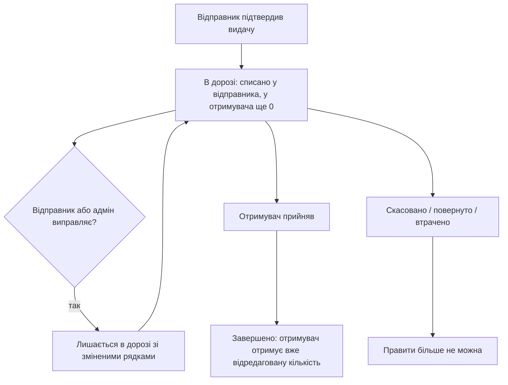

# REQ-EDIT_REL-007 — Редагування переміщення в дорозі

Документація фічі для продукту / QA.  
TCM: **REQ-EDIT_REL-007** (модуль `EDIT_REL`, батько `REQ-EDIT_REL`).

Технічний контракт і мапінг автотестів — у кінці файлу.

---

## 1. Навіщо це

Після підтвердження видачі товар уже списаний зі складу відправника, але ще не зарахований отримувачу. Видача в статусі **«В дорозі»**. Поки отримувач не прийняв, **той, хто відправив**, може виправити помилку — кількість, номенклатуру, склад призначення, дату, примітку, осіб накладної — **без скасування** і без нової видачі.

**Головне правило.** Owner править лише видачі «в дорозі», **які відправив зі свого складу**. Видачі, що їдуть **до нього**, правити не може — лише прийняти або скасувати.

Це **не** правка вже прийнятих надходжень і **не** правка зовнішніх переміщень з контрагентом. Те — батьківська фіча `REQ-EDIT_REL`.

---

## 2. Коли працює

Працює для видачі, поки вона **в дорозі**:

- **склад / виробництво / підрозділ → склад** (підтверджує отримувач);
- **підрозділ → екіпаж** або **підрозділ → точка вильоту** (підтверджує відправник).

Вікно закривається, коли видачу **прийнято** (отримувачем або відправником — залежно від маршруту), **скасовано**, **повернуто** або визнано **втраченою**.

Не ця фіча:

| Сценарій | Де живе |
|----------|---------|
| Видача на підрозділ, що завершується одразу (без «в дорозі») | `REQ-EDIT_REL` |
| Зовнішнє отримання від постачальника | `REQ-EDIT_REL` |
| Сама видача / повернення екіпажу (створення, підтвердження відправником, auto-forward) | `REQ-CREW-002` |

---

## 3. Хто може змінити

Owner складу А відправив на склад Б. Поки видача в дорозі:

| Хто (обрана локація) | Може правити? |
|----------------------|----------------|
| **Owner А** на складі А (він відправив) | Так — для типів **Склад**, **Виробництво**, **Підрозділ** |
| **Owner Б** на складі Б (їде **до нього**) | Ні. Лише «Прийняти» або «Скасувати» |
| **Адміністратор** на **конкретній** локації | Так |
| Адмін / користувач з багатьма локаціями, локація **не обрана** | Ні. Олівця немає |
| Інший склад, який у видачі не бере участі | Ні |

Тип відправника не знімає правило сторін: Owner виробництва чи підрозділу править лише те, що **сам відправив** зі цієї локації. Видача **на** підрозділ (отримувач UNIT) цим сценарієм не покривається — вона завершується одразу, без «в дорозі».

**Підрозділ → екіпаж / точка вильоту.** Видача лишається в дорозі, поки її не підтвердить **відправник**. Owner підрозділу може виправити її до підтвердження. Повернення від екіпажу — `REQ-CREW-002`.

Owner не «редагує все, що в дорозі на його екрані». Він редагує лише **свої** відправлення. Наявність права редагувати переміщення на складі-отримувачі цього не змінює.

Спроба Owner Б зберегти правку відхиляється **до** перевірки залишку: система не розкриває партії й наявність на чужому складі.

---

## 4. Що можна змінити, поки в дорозі

| Можна | Не можна |
|-------|----------|
| Кількість і склад рядків (список не порожній) | Склад-відправник |
| Дату переміщення | Порожню видачу (без рядків / без одиниць обладнання) |
| Примітку | Кількість більшу, ніж **вільний** залишок відправника плюс уже відвантажене цією видачею. Заброньований під заявку обсяг у цей ліміт не входить (`REQ-ORD`) |
| Осіб накладної | |
| Отримувача — з обмеженнями нижче | |

**Отримувач.** Можна перенаправити лише на інший **внутрішній** склад, який сам підтверджує отримання. Не можна відправити на **зовнішнього** контрагента. Для **обладнання** не можна змінити отримувача на **підрозділ** (UNIT): така видача не залишається в дорозі, а завершується одразу.

---

## 5. Залишки

До прийняття товар «висить» у відправника як відвантажений і **не з’являється** в отримувача.

При збереженні правки система:

1. Повертає попереднє списання на склад відправника.
2. Списує нові кількості. Ліміт = **вільний** залишок + те, що вже відвантажене **цією** видачею. Активна бронь заявки (`REQ-ORD`) цей ліміт зменшує: збільшити видачу **за рахунок заброньованого обсягу** не можна.
3. У отримувача до прийняття лишається **0**.

Якщо збереження заходить у заброньовану частину — система відхиляє правку: кількість видачі і залишок відправника без змін. Повідомлення: «Недостатньо вільного залишку ресурсу … — заброньовано N». У формі «Редагування видачі» підказка «заброньовано N (недоступно)», «Підтвердити» неактивна.

Зменшення кількості повертає різницю **в ту саму партію**. Після прийняття отримувач отримує **вже відредаговану** кількість, не початкову.

---

## 6. Якщо прийняли під час правки

Прийняття важливіше за правку. Якщо отримувач встиг прийняти, поки відправник ще зберігав зміни — видача **завершена** з тими рядками, які були на момент прийняття. Правка відправника не застосовується.

---

## 7. Обладнання

Ті самі ролі й те саме вікно «в дорозі».

Заміна одиниці:

- знята знову **доступна** на складі відправника;
- додана — **в дорозі** у відправника.

Прийняти обладнання, яке ще в дорозі, через форму **отримання** не можна — лише правка самої видачі або прийняття отримувачем у журналі «В дорозі».

---

## 8. Екран

**Видати / Отримати** → вкладка **«В дорозі»** → олівець → форма **«Редагування видачі»**.

Олівець з’являється лише коли в «Робочий простір» обрана **конкретна** локація.

| Ситуація | Що видно |
|----------|----------|
| Owner на складі, **з якого** відправив | Олівець, форма зберігає правку, рядок лишається «В дорозі» |
| Owner на складі, **куди** їде видача | Немає «Редагувати». Є «Прийняти» і «Скасувати» |
| Адмін на конкретній локації | Олівець (якщо є право правити видачу відправника) |
| Після прийняття | Рядка немає на «В дорозі» |
| Локація не обрана (адмін / користувач з багатьма локаціями: у списку «Всі локації», селектор **«Оберіть склад...»**) | Олівця немає. «Прийняти», «Скасувати», «Створити інцидент» лишаються видимими, але неактивні |
| Збільшення кількості в заброньовану частину (`REQ-ORD`) | Підказка «заброньовано N (недоступно)»; «Підтвердити» неактивна |

---

## 9. Критерії приймання

| AC | Бізнес-правило |
|----|----------------|
| AC-01 | Owner править лише ті видачі в дорозі, які сам відправив (склад / виробництво / підрозділ, зокрема на екіпаж і точку вильоту). Видачі «до нього» — ні. Адмін може з будь-якої локації. |
| AC-02 | Правка змінює лише залишок відправника; у отримувача до прийняття 0; після прийняття — вже відредагована кількість. |
| AC-03 | Відправника змінити не можна. Нового отримувача — лише внутрішній склад, який підтверджує отримання. Зовнішній контрагент заборонений; обладнання — не на підрозділ. |
| AC-04 | Якщо отримувач прийняв під час правки — прийняття перемагає. |
| AC-05 | Обладнання: ті самі ролі; заміна одиниці повертає зняту на склад і ставить нову в дорогу; отримання ще в дорозі — ні. |
| AC-06 | На «В дорозі» олівець у відправника (і в адміна) лише при конкретній обраній локації; у отримувача його немає; після прийняття рядок зникає. Без обраної локації («Всі локації» → «Оберіть склад...») олівець не відображається. |
| AC-07 | Порожню видачу і кількість понад **вільний** залишок (плюс уже відвантажене цією видачею) зберегти не можна. Заброньований обсяг недоступний. Спроба отримувача відхиляється без розкриття партій. |

**Застаріле:** кейс «видачу в дорозі правити не можна» (`TC-REL-041`) більше не актуальний.

---

## 10. Технічний контракт

Для автотестів і розробки. Не підміняє бізнес-правила вище.

| Шар | Де |
|-----|-----|
| API ресурсів | `PUT /api/v1/relocations/{id}/send?storageId=` |
| API обладнання | `PUT /api/v1/relocations/equipment/{id}/send?storageId=` |
| Право | `relocation:update` на `storageId` |
| UI | `/relocations` → «В дорозі» → олівець |

Статус у системі: «В дорозі» = `CREATED`. Після прийняття = `FINISHED`. Відмова: без права / не відправник → 403; закритий статус / порожні рядки / понад вільний залишок / заброньовано / заборонений отримувач → 400; застаріла версія під час правки ще в дорозі → 409.

**Нюанс SUT (ресурси):** перевірка «отримувач підтверджує доставку» відсікає EXTERNAL (і crew ↔ fly-point). UNIT / CREW / FLY_POINT як новий отримувач **ресурсного** send цим чеком не блокуються. Для **обладнання** перенаправлення на UNIT блокується.

Службовий сьют: `mvn test -Denv=dev -Dsuite=edit-rel-007-verify`

| AC | Кейси | Автотест |
|----|--------|----------|
| AC-01 | TC-REL-041 (DEPRECATED), 072, 073, 085, 086, 087, 088, 089 | `RelocationTest`, `RelocationInTransitEditTest` (087–089: UNIT = `order.requester.unit.name`, Owner = 3bat) |
| AC-02 | 070, 071, 080, 082 | `RelocationTest`, `RelocationInTransitEditTest` |
| AC-03 | 077, 078, 079 | `RelocationInTransitEditTest` |
| AC-04 | 074 | `RelocationTest` |
| AC-05 | TC-EQ-IT-001…004 | `EquipmentRelocationTest` |
| AC-06 | TC-UI-REL-018…021 | `RelocationEditActionsUiTest` |
| AC-07 | 075, 076, 084 | `RelocationInTransitEditTest` |
| AC-10 (`REQ-ORD`) | TC-ORD-REG-007, TC-ORD-UI-026 | `OrderStockRegressionApiTest`, `OrderFreeStockUiTest` |
