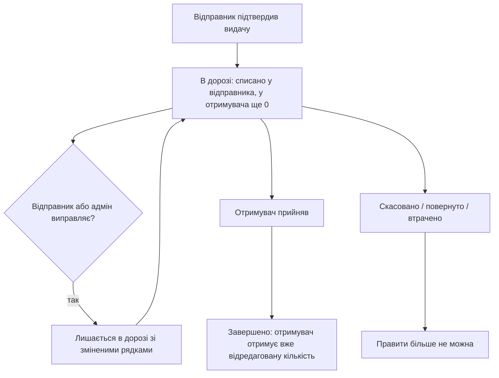

# REQ-EDIT_REL-007 — Редагування переміщення в дорозі

Документація фічі для продукту / QA.  
TCM: **REQ-EDIT_REL-007** (модуль `EDIT_REL`, батько `REQ-EDIT_REL`).

Технічний контракт і мапінг автотестів — у кінці файлу.

---

## 1. Навіщо це

Після підтвердження видачі товар уже списаний зі складу відправника, але ще не зарахований отримувачу. Видача в статусі **«В дорозі»**. Поки отримувач не прийняв, **користувач із правом на локацію-відправник** може виправити помилку — кількість, номенклатуру, склад призначення, дату, примітку, осіб накладної — **без скасування** і без нової видачі.

**Головне правило.** Звичайну внутрішню видачу А→Б у статусі «В дорозі» редагує лише сторона відправника: адміністратор або користувач із правом на склад А. Особисте авторство не є умовою — інший комірник того самого складу з такими самими правами теж може редагувати. Склад Б бачить адресовану йому видачу та може прийняти або скасувати її, але не редагувати.

Це **не** правка вже прийнятих надходжень і **не** правка зовнішніх переміщень з контрагентом. Те — батьківська фіча `REQ-EDIT_REL`.

---

## 2. Коли працює

Працює для видачі, поки вона **в дорозі**:

- **склад / виробництво / підрозділ → склад** (підтверджує отримувач);
- **підрозділ → екіпаж** або **підрозділ → точка вильоту** (підтверджує відправник).
- **точка вильоту → точка вильоту** (підтверджує склад-ініціатор через точку-відправник).

Вікно закривається, коли видачу **прийнято** (отримувачем або відправником — залежно від маршруту), **скасовано**, **повернуто** або визнано **втраченою**.

Не ця фіча:

| Сценарій | Де живе |
|----------|---------|
| Видача на підрозділ, що завершується одразу (без «в дорозі») | `REQ-EDIT_REL` |
| Зовнішнє отримання від постачальника | `REQ-EDIT_REL` |
| Сама видача / повернення екіпажу (створення, підтвердження відправником, auto-forward) | `REQ-CREW-002` |

---

## 3. Хто може змінити

Owner складу А відправив на склад Б. Поки видача в дорозі:

| Хто (обрана локація) | Може правити? |
|----------------------|----------------|
| **Owner / комірник А** з правом на склад А (у тому числі інший користувач, ніж автор) | Так — для типів **Склад**, **Виробництво**, **Підрозділ** |
| **Owner Б** на складі Б (їде **до нього**) | Ні. Лише «Прийняти» або «Скасувати» |
| **Адміністратор** на **конкретній** локації | Так |
| Адмін / користувач з багатьма локаціями, локація **не обрана** | Ні. Олівця немає |
| Інший склад, який у видачі не бере участі | Ні |

Тип відправника не знімає правило сторін: Owner виробництва чи комірник підрозділу править лише видачу **зі своєї локації-відправника**, навіть якщо її створив інший уповноважений користувач. Видача **на** підрозділ (отримувач UNIT) цим сценарієм не покривається — вона завершується одразу, без «в дорозі».

Для передачі **між точками вильоту** ініціатором є склад, який здійснив передачу. Його комірник із правом на точку-відправник може виправити операцію; інший комірник з тими самими правами також може. Спільна область `CREWS` на батальйон не дає комірнику складу Б права редагувати передачу між точками складу А.

**Підрозділ → екіпаж / точка вильоту.** Видача лишається в дорозі, поки її не підтвердить **відправник**. Owner підрозділу може виправити її до підтвердження. Повернення від екіпажу — `REQ-CREW-002`.

Owner не «редагує все, що в дорозі на його екрані». Він редагує лише **свої** відправлення. Наявність права редагувати переміщення на складі-отримувачі цього не змінює.

Спроба Owner Б зберегти правку відхиляється **до** перевірки залишку: система не розкриває партії й наявність на чужому складі.

---

## 4. Що можна змінити, поки в дорозі

| Можна | Не можна |
|-------|----------|
| Кількість і склад рядків (список не порожній) | Склад-відправник |
| Дату переміщення | Порожню видачу (без рядків / без одиниць обладнання) |
| Примітку | Кількість більшу, ніж **вільний** залишок відправника плюс уже відвантажене цією видачею. Заброньований під заявку обсяг у цей ліміт не входить (`REQ-ORD`) |
| Осіб накладної | |
| Отримувача — з обмеженнями нижче | |

**Отримувач.** Можна перенаправити лише на інший **внутрішній** склад, який сам підтверджує отримання. Не можна відправити на **зовнішнього** контрагента. Для **обладнання** не можна змінити отримувача на **підрозділ** (UNIT): така видача не залишається в дорозі, а завершується одразу.

**Часова межа (CPMA-796).** Одноденне вікно діє для локації-відправника, якщо **будь-який її предок у ланцюжку parent має id `2151`** (TSUK). Правило поширюється і на прямих дітей TSUK, і на вкладених нащадків; тип самої локації та глибина ієрархії значення не мають. Зокрема, для передачі `FP1 → FP2` перевіряється ланцюжок предків точки-відправника `FP1`, а операцію виконує комірник складу-ініціатора з правом на цю точку. Для користувача без ролі адміністратора дата переміщення під час створення або редагування може бути сьогоднішньою чи вчорашньою, але не давнішою. Під час редагування сервер перевіряє також дату вже збереженої видачі: старий запис не можна розблокувати, передатувавши запит на сьогодні. Видалення старого переміщення так само відхиляється. Адміністратор звільнений від цієї нижньої межі.

Якщо `2151` відсутній у всьому ланцюжку предків або локація не має parent, нижньої часової межі немає: давнє переміщення можна створити, редагувати й видалити за наявності відповідних прав і допустимого статусу. Прийняття переміщення не обмежується його датою, зокрема всередині TSUK-ієрархії. В автотестах стабільний TSUK parent `2151` резолвиться через pool `TSUK_PARENT_UNITS`, а не дублюється як ID у сценаріях. Правило охоплює ресурси й обладнання; автотести ресурсних переміщень — `RelocationOneDayLimitTest`, `TC-REL-DATE-001…023`, та `TC-REL-091`. Кейси `018…021` окремо фіксують межі створення й редагування `FP1 → FP2` комірником TSUK-складу.

**Майбутня дата.** Окрема вимога `REQ-WMS-001-001` забороняє дату пізніше сьогодні для всіх ролей, включно з адміністратором. Обмеження перевіряється і формою видачі, і сервером; API-тести `TC-REL-DATE-010…013` очікують відмову з помилкою поля `date`.

---

## 5. Залишки

До прийняття товар «висить» у відправника як відвантажений і **не з’являється** в отримувача.

При збереженні правки система:

1. Повертає попереднє списання на склад відправника.
2. Списує нові кількості. Ліміт = **вільний** залишок + те, що вже відвантажене **цією** видачею. Активна бронь заявки (`REQ-ORD`) цей ліміт зменшує: збільшити видачу **за рахунок заброньованого обсягу** не можна.
3. У отримувача до прийняття лишається **0**.

Якщо збереження заходить у заброньовану частину — система відхиляє правку: кількість видачі і залишок відправника без змін. Повідомлення: «Недостатньо вільного залишку ресурсу … — заброньовано N». У формі «Редагування видачі» підказка «заброньовано N (недоступно)», «Підтвердити» неактивна.

Зменшення кількості повертає різницю **в ту саму партію**. Після прийняття отримувач отримує **вже відредаговану** кількість, не початкову.

---

## 6. Якщо прийняли під час правки

Прийняття важливіше за правку. Якщо отримувач встиг прийняти, поки відправник ще зберігав зміни — видача **завершена** з тими рядками, які були на момент прийняття. Правка відправника не застосовується.

---

## 7. Обладнання

Ті самі ролі й те саме вікно «в дорозі».

Заміна одиниці:

- знята знову **доступна** на складі відправника;
- додана — **в дорозі** у відправника.

Прийняти обладнання, яке ще в дорозі, через форму **отримання** не можна — лише правка самої видачі або прийняття отримувачем у журналі «В дорозі».

---

## 8. Екран

**Видати / Отримати** → вкладка **«В дорозі»** → олівець → форма **«Редагування видачі»**.

Олівець з’являється лише коли в «Робочий простір» обрана **конкретна** локація.

| Ситуація | Що видно |
|----------|----------|
| Owner або комірник з правом на склад, **з якого** відправлено | Олівець, форма зберігає правку, рядок лишається «В дорозі» |
| Owner на складі, **куди** їде видача | Немає «Редагувати». Є «Прийняти» і «Скасувати» |
| Адмін на конкретній локації | Олівець (якщо є право правити видачу відправника) |
| Після прийняття | Рядка немає на «В дорозі» |
| Локація не обрана (адмін / користувач з багатьма локаціями: у списку «Всі локації», селектор **«Оберіть склад...»**) або обрана локація, яка не є стороною видачі | Олівця немає. «Прийняти», «Скасувати» видимі, але disabled; тултіп «Оберіть конкретну локацію в бічній панелі для виконання дії». Банера «Помилка. Оновіть сторінку» немає |
| Збільшення кількості в заброньовану частину (`REQ-ORD`) | Підказка «заброньовано N (недоступно)»; «Підтвердити» неактивна |

Олівець відкриває **форму того самого процесу, через яку створено видачу**: видача на локацію, видача на екіпаж або передача між точками вильоту. Поточні дані вже заповнені; після зміни примітки зберігається те саме переміщення зі статусом «В дорозі».

---

## 9. Критерії приймання

| AC | Бізнес-правило |
|----|----------------|
| AC-01 | Адмін або користувач із правом на локацію-відправник править її видачу в дорозі незалежно від особистого авторства. Для передачі між точками діє право складу-ініціатора на точку-відправник. Отримувач звичайної видачі може її прийняти або скасувати, але не редагувати. |
| AC-02 | Правка змінює лише залишок відправника; у отримувача до прийняття 0; після прийняття — вже відредагована кількість. |
| AC-03 | Відправника змінити не можна. Нового отримувача — лише внутрішній склад, який підтверджує отримання. Зовнішній контрагент заборонений; обладнання — не на підрозділ. |
| AC-04 | Якщо отримувач прийняв під час правки — прийняття перемагає. |
| AC-05 | Обладнання: ті самі ролі; заміна одиниці повертає зняту на склад і ставить нову в дорогу; отримання ще в дорозі — ні. |
| AC-06 | На «В дорозі» олівець у користувача з правом на локацію-відправник (і в адміна) лише при конкретній обраній локації; у отримувача його немає; після прийняття рядок зникає. Без обраної локації або на сторонній локації дії недоступні. На складі отримувача «Прийняти» активна. |
| AC-07 | Порожню видачу і кількість понад **вільний** залишок (плюс уже відвантажене цією видачею) зберегти не можна. Заброньований обсяг недоступний. Спроба отримувача відхиляється без розкриття партій. |
| AC-08 | Олівець відкриває відповідну початковому процесу форму (локація, екіпаж, між точками); примітка зберігається в тому самому переміщенні, яке лишається «В дорозі». Перевірка: адмін 3 форми, комірник батальйону 3 форми, BUSINESS_UNIT_OWNER виробництва 1 форма. |
| AC-09 | Сторонній склад не може за прямим ID-запитом редагувати, приймати, скасовувати або видаляти чуже переміщення; після 403 воно не змінюється. Спільна CREWS-область не знімає цю межу. |

Суміжний критерій `REQ-EDIT_REL / AC-08` задає нижню часову межу для всіх типів відправника в TSUK-ієрархії, включно з `FLY_POINT`. Для `FP1 → FP2`: вчорашнє створення та редагування дозволені; створення з датою позавчора і правка вже збереженого старого переміщення відхиляються з HTTP 400 по полю `date` без зміни запису та залишків.

**Застаріле:** кейс «видачу в дорозі правити не можна» (`TC-REL-041`) більше не актуальний.

---

## 10. Технічний контракт

Для автотестів і розробки. Не підміняє бізнес-правила вище.

| Шар | Де |
|-----|-----|
| API ресурсів | `PUT /api/v1/relocations/{id}/send?storageId=` |
| API обладнання | `PUT /api/v1/relocations/equipment/{id}/send?storageId=` |
| Право | `relocation:update` на `storageId` |
| UI | `/relocations` → «В дорозі» → олівець |

Статус у системі: «В дорозі» = `CREATED`. Після прийняття = `FINISHED`. Відмова: без права / не відправник → 403; закритий статус / порожні рядки / понад вільний залишок / заброньовано / заборонений отримувач → 400; застаріла версія під час правки ще в дорозі → 409.

**Нюанс SUT (ресурси):** перевірка «отримувач підтверджує доставку» відсікає EXTERNAL (і crew ↔ fly-point). UNIT / CREW / FLY_POINT як новий отримувач **ресурсного** send цим чеком не блокуються. Для **обладнання** перенаправлення на UNIT блокується.

Підтримуваний набір API/UI переміщень: `mvn test -Denv=dev -Dsuite=relocations`

| AC | Кейси | Автотест |
|----|--------|----------|
| AC-01 | TC-REL-041 (DEPRECATED), 072, 073, 085, 086, 087, 088, 089 | `RelocationTest`, `RelocationInTransitEditTest` (087–089: UNIT = `order.requester.unit.name`, Owner = 3bat) |
| AC-02 | 070, 071, 080, 082 | `RelocationTest`, `RelocationInTransitEditTest` |
| AC-03 | 077, 078, 079 | `RelocationInTransitEditTest` |
| AC-04 | 074 | `RelocationTest` |
| AC-05 | TC-EQ-IT-001…004 | `EquipmentRelocationTest` |
| AC-06 | TC-UI-REL-018…023 | `RelocationEditActionsUiTest` |
| AC-07 | 075, 076, 084 | `RelocationInTransitEditTest` |
| AC-01 | TC-REL-EDIT-SCOPE-001 | `BattalionRelocationEditUiTest` — інший комірник складу А редагує передачу між його точками |
| AC-08 | TC-UI-REL-EDIT-001…007 | `BattalionRelocationEditUiTest` — правильна форма та збереження правки за трьома ролями |
| AC-09 | TC-REL-EDIT-SCOPE-002/003/005 | `BattalionRelocationEditUiTest` — сторонній склад отримує 403 на зміну/видалення |
| `REQ-EDIT_REL / AC-08` — часова межа | TC-REL-DATE-001…021, TC-REL-091 | `RelocationOneDayLimitTest`, `RelocationInTransitEditTest` — обмеження для всіх нащадків TSUK, у тому числі `FP1 → FP2` під комірником; ієрархія без TSUK та null parent без нижньої межі; прийняття без обмеження дати |
| AC-10 (`REQ-ORD`) | TC-ORD-REG-007, TC-ORD-UI-026 | `OrderStockRegressionApiTest`, `OrderFreeStockUiTest` |
