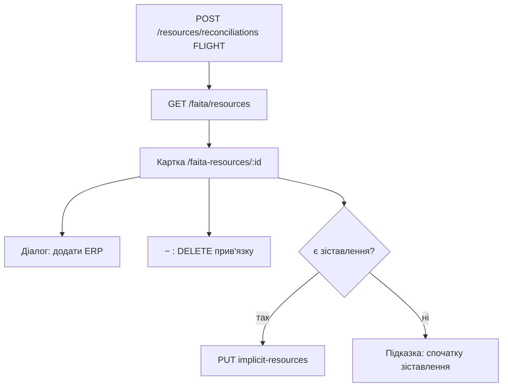

# REQ-FAITA-001 — Ресурси Файти — зіставлення та додаткові ресурси

Документація фічі для QA / продукту / автотестів.  
TCM feature: **REQ-FAITA-001** (модуль FAITA, parent `REQ-INTEGRATION`).  
Дзеркало в репо: `docs/REQ-FAITA-001-faita-resources.md`.  
SUT: backend `tk`, frontend `tk-ui`. Автотести: `erp-auto-test`.

Суміжні фічі (не дублювати тут повністю):

| Feature | Що дає цій фічі |
|---------|-----------------|
| `REQ-CREW-003` AC-15 | Списання implicit при використанні виробу екіпажем (`TC-FAITA-IMPL-001/002`) |
| `REQ-INTEGRATION` | Батьківська фіча інтеграцій |

---

## 1. Огляд

Екран **Ресурси Файти** (`/faita-resources`) — зіставлення виробу з польової системи (FAITA / Fight, `source=FLIGHT`) з номенклатурою ERP і налаштування **додаткових (implicit)** ресурсів, які списуються разом із виробом.

### 1.1. Терміни

| Термін | Значення |
|--------|----------|
| **FAITA / FLIGHT** | Зовнішній виріб: `externalId` + `externalName` |
| **Зіставлення (reconciliation)** | Прив’язка `FLIGHT` → один або кілька ERP `resourceId` |
| **Додаткові / implicit** | Інші FAITA-вироби, які списуються разом із основним |
| **Список FAITA** | `GET /api/v1/integrations/faita/resources` — лише вироби, у яких уже є хоча б одне FLIGHT зіставлення |

### 1.2. Права

Усі операції: `resource-reconciliation::read|create|delete`. У матриці erp-auto-test — **лише ADMIN**. OWNER_1 / ANONYMOUS — 403.

---

## 2. Бізнес-правила

1. Виріб з’являється в списку **лише після** першого `POST /resources/reconciliations` з `source=FLIGHT`.
2. **1 FAITA → N ERP**: один POST може передати кілька `resourceIds`; повторний POST додає нові пари. Існуючі пари ідемпотентні (`findByUniqueMapping`).
3. **POST не видаляє** невідмічені в діалозі ERP. Зняти прив’язку можна лише `DELETE /resources/reconciliations/{id}` (API) або `DELETE` з тілом (UI «−»).
4. **Implicit** зберігаються **повним списком** `PUT .../implicit-resources`. Додати / прибрати = новий повний набір.
5. У combobox implicit — лише інші позиції з того ж GET-списку (тобто вже зіставлені FAITA-вироби).
6. UI: кнопка «Додати ресурс» у блоці implicit **лише якщо** `reconciliations.length > 0`.

---

## 3. API

| Метод | Path | Enum | Примітка |
|-------|------|------|----------|
| GET | `/api/v1/integrations/faita/resources` | `FAITA_RESOURCES_GET` | Список виробів + reconciliations + implicit |
| PUT | `/api/v1/integrations/faita/resources/{externalId}/implicit-resources` | `FAITA_IMPLICIT_RESOURCES_PUT` | Повний набір implicit |
| POST | `/api/v1/resources/reconciliations` | `RESOURCE_RECONCILIATION_CREATE` | `{ source, externalId, externalName, resourceIds }` |
| DELETE | `/api/v1/resources/reconciliations/{id}` | `RESOURCE_RECONCILIATION_DELETE_BY_ID` | Зняти одну прив’язку |
| DELETE | `/api/v1/resources/reconciliations` | — | Тіло як у POST; так працює UI «−» |

GET map reconciliations **без id** (лише `source` + `resource.id/name`). Для DELETE-by-id тести беруть id з відповіді CREATE.

SUT (read-only): `FaitaResourceController`, `FaitaResourceRepository`, `ResourceReconciliationFacade`.

---

## 4. UI (tk-ui)

| Екран | Route | Нотатки |
|-------|-------|---------|
| Список | `/faita-resources` | PageTabs групи «Екіпажі», **без h1**. Пошук «Пошук за назвою...». Тип: Боєприпаси / Ініціатори (`i-`) / Технічні (`d-`). Колонки: ID, Назва, Зіставлення, Додаткові ресурси |
| Картка | `/faita-resources/:resourceId` | h1 = назва виробу. Картки «Зіставлення» і «Використання додаткових ресурсів» |
| Діалог | — | «Знайдіть відповідний ресурс у системі» → «Призначити ресурс» |

Sidebar: група **Екіпажі** → вкладка **Ресурси Файти**.

---

## 5. Acceptance criteria і кейси

| AC | Суть | Кейси |
|----|------|-------|
| AC-01 | Зіставлення 1→N: create, extend, delete | `TC-FAITA-REC-001/002/003` |
| AC-02 | Implicit: зберегти кілька, замінити/прибрати | `TC-FAITA-IMPL-003` (+ `TC-FAITA-IMPL-001` на REQ-CREW-003) |
| AC-03 | UI список + картка CRUD | `TC-UI-FAITA-001…004` |

Автотести: `FaitaResourcesApiTest`, `FaitaResourcesUiTest`, `FaitaResourceFixture`.  
Suite: `functional.xml`, `storage-regions.xml`, `regression.xml`, `ui-dev.xml`, `faita-resources.xml`.

Якщо `GET /integrations/faita/resources` ≠ 200 — SkipException (немає FaitaResourceController на env).
