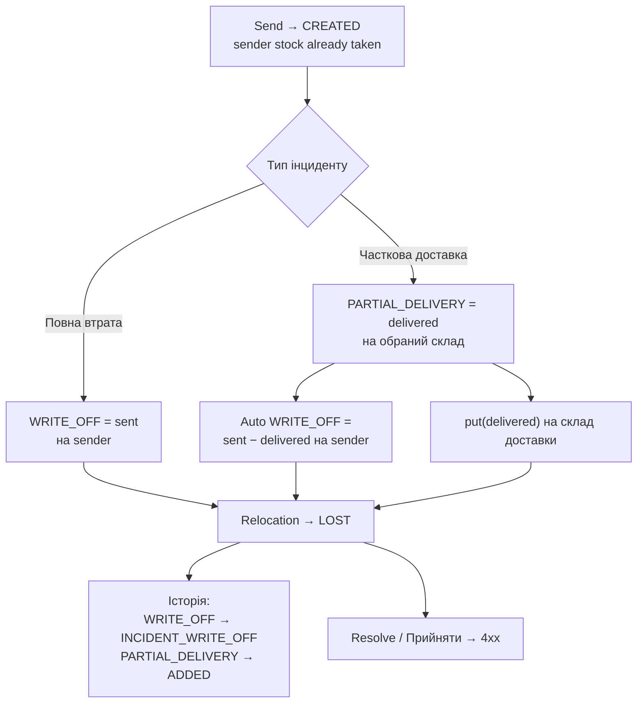

# REQ-WMS-008 — Надзвичайні події на переміщеннях

Документація фічі для команди QA / продукту / автотестів.  
TCM feature: **REQ-WMS-008** (модуль WMS).  
SUT: backend `tk`, frontend `tk-ui`. Автотести: `erp-auto-test`.  
SSOT у репозиторії: `docs/REQ-WMS-008-incidents.md`.

---

## 1. Огляд

**Надзвичайна подія (інцидент)** — фіксація втрати або часткової доставки вантажу на переміщенні ресурсів у статусі **CREATED** («В дорозі»).

| Тип (UI) | API `operation` | Суть |
|----------|-----------------|------|
| Ресурси повністю втрачено | `WRITE_OFF` | Уся кількість списана як втрата на відправнику |
| Часткова доставка | `PARTIAL_DELIVERY` (+ auto `WRITE_OFF`) | Частина «доставлена» на обраний склад; решта — WRITE_OFF на sender |

Після створення інциденту relocation переходить у **LOST** («Втрачено»). Це **не** `FINISHED`: resolve/«Прийняти» після LOST відхиляються. Фактично інцидент **автоматично завершує** переміщення в кінцевому статусі LOST.

### API

| Метод | Path | Permission |
|-------|------|------------|
| POST | `/api/v1/incidents/relocations` | `incident::create` + access to relocation |
| GET | `/api/v1/incidents/relocations/{relocationId}` | `incident::view` + access |
| DELETE | `/api/v1/incidents/relocations/{relocationId}` | `incident::delete` + access |

Access (`@tk.hasAccessToRelocation`): `business-unit-list::read` на **sender або recipient**.

### UI

- Журнал `/relocations` → «В дорозі» → **Створити інцидент** → `/relocation/create-incident/:id`
- Вкладка **Втрачено** (потрібен `incident::view`) → **Деталі інциденту** / видалення
- Історія операцій `/history` → картка **Надзвичайні події** (`INCIDENT_WRITE_OFF`)

Обмеження UI: не EQUIPMENT; не режим «Всі локації»; стан CREATED.

---

## 2. Acceptance Criteria

База — TCM AC-01…AC-04. Нижче: **очікуваний контракт** і **факт SUT**, де вони розходяться.

### AC-01 — Створення інциденту (повна втрата)

**TCM:** Інцидент переводить переміщення у «Втрачено» і списує товар у відправника; отримувач без змін (немає credit через resolve).

**Хто може створити**

- Потрібно: `incident::create` **і** доступ до relocation (BU read на sender **або** recipient).
- **Обидві сторони** можуть створити інцидент (не лише відправник).
- Приклад staging/dev: **alkatras** (`OWNER_1`) відправляє на **bar** (`OWNER_2`) — якщо в обох є permission, обидва можуть POST і перевести relocation у LOST.

**Фактичний inventory:** при send залишок уже знятий з sender (`take`). Інцидент не робить `put` отримувачу. Історія: `INCIDENT_WRITE_OFF` на sender.

### AC-02 — Видалення інциденту

**TCM:** DELETE повертає переміщення до **CREATED**.

**Факт / gaps**

- GET після delete → 404; relocation знову CREATED.
- Після partial delivery: stock на складі доставки відкочується (`storageItemService.take`).
- Історія: чиститься **лише** `INCIDENT_WRITE_OFF`; записи `ADDED` від PARTIAL_DELIVERY **залишаються** (gap / TC-INC-PD-004).

### AC-03 — Часткова доставка

**TCM (очікування):** StorageItem на складі доставки += delivered; решта WRITE_OFF у відправника; LOST; DELETE відкочує stock і історію.

**Правило кількості (на item):**

```text
PARTIAL_DELIVERY + WRITE_OFF = sent
```

Backend (`IncidentMapper`): клієнт шле лише `PARTIAL_DELIVERY` lines; якщо `delivered + lost < sent` — auto-додає `WRITE_OFF` remainder на **sender**.

**Факт SUT**

| Аспект | Факт |
|--------|------|
| Stock на delivery storage | += delivered (`IncidentFacade` → `storageItemService.put`) |
| Remainder WRITE_OFF | Так (mapper на sender) |
| Relocation | LOST |
| `delivered > sent` / negative | API 4xx (`IncidentValidator`) + UI блокує Save |
| DELETE після PD | CREATED + stock `take`; історія: `INCIDENT_WRITE_OFF` clean, **`ADDED` лишається** |

### AC-04 — UI відображення

**TCM:** створення/перегляд/скасування; у журналі «Втрачено» та в історії «Надзвичайні події» — кількість **втраченого (WRITE_OFF)**, не загальна кількість переміщення.

**Факт**

- Історія (`totalIncidentResources` / картка) — WRITE_OFF amounts (коректно для агрегату).
- Вкладка «Втрачено», колонка ресурсів — зараз `relocation.items.amount` (**sent**). Для partial delivery це **баг UI** (має бути remainder WRITE_OFF; CPMA-652 / TC-UI-INC-PD-003).

### AC-05 (пропозиція для TCM) — CREW / FLY_POINT

Текст-кандидат (ще не обов’язково в TCM):

> Надзвичайна подія на видачі STORAGE→CREW / STORAGE→FLY_POINT використовує той самий API; LOST блокує finish і auto-forward на FLY_POINT; CREW/FLY_POINT не отримують stock; DELETE повертає CREATED і дозволяє sender завершити видачу.

Деталі — розділ 4. PD-сценарії для CREW/FLY у автотестах відсутні (лише full WRITE_OFF).

---

## 3. Бізнес-потоки (STORAGE → STORAGE)



### Повна втрата vs часткова доставка

| | Повна втрата | Часткова доставка |
|--|--------------|-------------------|
| UI radio | «Ресурси повністю втрачено» | «Часткова доставка» |
| Поле кількості | «Втрачено» (disabled = sent) | «Доставлено» (editable) |
| `storageId` у payload | Sender | Обраний sender **або** recipient |
| Auto WRITE_OFF | Весь sent (клієнт шле WRITE_OFF) | Remainder на sender |
| Stock | Без credit отримувачу | `put(delivered)` на склад доставки |
| Історія | `INCIDENT_WRITE_OFF` @ sender | `ADDED` @ delivery + `INCIDENT_WRITE_OFF` @ sender |

### Валідації

| Правило | UI | API (факт) |
|---------|-----|------------|
| `delivered > sent` | «Перевищує…», Save disabled | 4xx (`exceedsRelocation`) |
| `WRITE_OFF > sent` | Поле disabled на full loss | 4xx (`exceedsRelocation`) |
| `amount < 0` | Save disabled / min=0 | 4xx (`amount.negative`) |
| `amount = 0` (PD) | Не в payload (`selectedRows`) | Дозволено; `put` пропускає 0 |

### Delete після інциденту

1. DELETE → incident 404, state **CREATED**.
2. Після PD: stock rollback через `take` на складі доставки.
3. Cleanup history: `INCIDENT_WRITE_OFF` так; `ADDED` від PD — **ні** (gap).

---

## 4. CREW і точки вильоту (FLY_POINT)

Окремий бізнес-контекст видачі на екіпаж / точку вильоту. **Окремого incident API немає** — той самий `POST /incidents/relocations` і UI «Створити інцидент».

### 4.1. Як створюється надзвичайна подія

1. Відправник (типово OWNER storage) робить **send → CREW** або **send → FLY_POINT** → relocation **CREATED**.
2. Поки стан CREATED, користувач з `incident::create` і доступом до relocation (sender або recipient BU) відкриває **Створити інцидент** (або API POST).
3. Типовий сценарій у тестах — **повна втрата** (`WRITE_OFF` на всю кількість).
4. Після create: relocation → **LOST**; CREW / FLY_POINT **не** отримують залишок; на sender в історії — `INCIDENT_WRITE_OFF`.

### 4.2. Відмінності від STORAGE → STORAGE

| Аспект | STORAGE → STORAGE | STORAGE → CREW / FLY_POINT |
|--------|-------------------|----------------------------|
| Хто «Приймає» (finish) | Отримувач | **Відправник** (sender-managed / `isManagedBySender`) |
| Кнопка інциденту | Та сама | Та сама (не CREW-specific) |
| Після LOST | Resolve 4xx | Sender **не** може FINISHED |
| Auto-forward attached CREW → FLY_POINT | N/A | Лише на **FINISHED** / AUTO_FINISHED; **LOST не тригерить** forward |
| Stock на отримувачі після інциденту | PD: credit delivered; full loss: без credit | CREW / FLY_POINT без credit (тести — full loss) |

### 4.3. Правила (з TC-CREW-INC-*)

| Правило | Опис |
|---------|------|
| LOST без credit | Після інциденту на send→CREW / FLY_POINT склад екіпажа / точки не збільшується |
| Немає finish після LOST | Sender resolve FINISHED → 4xx |
| Немає інциденту після FINISHED | POST incident → 4xx |
| DELETE → finish | DELETE повертає CREATED; далі sender FINISHED → CREW отримує stock |
| Attached CREW + LOST | Немає auto-forward на parent FLY_POINT, поки LOST |
| Вікно CREATED | Потрібне для інциденту; прямий CREW→FLY_POINT часто одразу AUTO_FINISHED — інцидент недоступний |

### 4.4. Тестові нотатки

- У `CrewFlyPointIncidentTest` актор create/delete часто **ADMIN** (на staging `OWNER_1` може не мати `incident::create`).
- STORAGE suite (alkatras/bar) використовує `OWNER_1` / `OWNER_2` з permission.
- PD на CREW/FLY не покритий автотестами.

### 4.5. Пропонований AC-05 (для узгодження з продуктом)

Див. формулювання в розділі 2. Після узгодження — створити AC у TCM під REQ-WMS-008.

---

## 5. Матриця автотестів

### STORAGE → STORAGE / загальне

| ID | Шар | Суть |
|----|-----|------|
| TC-INC-001…005 | API | Create LOST, recipient stock, no resolve, delete, only CREATED |
| TC-INC-006 | API | Відправник (alkatras) create → LOST |
| TC-INC-011 | API | WRITE_OFF > sent → 4xx |
| TC-INC-012 | API | Одержувач (bar) create → LOST |
| TC-INC-PD-001…008 | API | PD happy / multi / sender delivery / delete |
| TC-INC-PD-009…010 | API | delivered > sent / negative → 4xx |
| TC-UI-INC-001…003 | UI | Full loss create/details/delete, history, Lost qty |
| TC-UI-INC-PD-001…005 | UI | PD create, history, Lost qty ≠ sent, validation disable |

Suites: `relocations.xml`, `regression.xml`, `ui.xml`.

### CREW / FLY_POINT

| ID | Суть |
|----|------|
| TC-CREW-INC-001 | send→CREW + incident → LOST, crew без credit |
| TC-CREW-INC-002 | send→FLY_POINT + incident → LOST |
| TC-CREW-INC-003 | LOST → sender не FINISHED |
| TC-CREW-INC-004 | FINISHED → не можна incident |
| TC-CREW-INC-005 | DELETE → CREATED → finish → crew credit |
| TC-CREW-INC-006 | Attached CREW + LOST → немає auto-forward |

Suite: `storage-regions.xml`, також у `relocations.xml` / `regression.xml`.

---

## 6. Відомі дефекти / gaps (продукт)

1. **DELETE після PD** не чистить історію `ADDED` (`onIncidentDeleted` видаляє лише `INCIDENT_WRITE_OFF`) — TC-INC-PD-004.
2. **Lost tab UI** показує `items.amount` (sent), а не WRITE_OFF remainder — CPMA-652 / TC-UI-INC-PD-003.

Автотести з expected-контрактом на ці gaps позначені `regression` / `known-defect` у TCM і `@Description`.

---

## 7. Ключові файли SUT (read-only)

**Backend `tk`**

- `IncidentController`, `IncidentFacade`, `IncidentMapper`, `IncidentValidator`
- `TkAuthorization.hasAccessToRelocation`
- `ResourceOperationHistoryService` (`onIncidentCreated` / `onIncidentDeleted`)
- `ResourceRelocationStateStrategy` (немає гілки LOST)
- `FlyPointFacade` (auto-forward)
- `RelocationValidator` (`isManagedBySender`)

**Frontend `tk-ui`**

- `RelocationCreateIncidentPage` / `useRelocationCreateIncident`
- `active-relocation-columns` (кнопка інциденту)
- `LostRelocations` / `lost-relocation-columns` / `RelocationListCell`
- `IncidentDetailsDialog`
- `OperationHistoryPage` (картка «Надзвичайні події»)

**Автотести**

- `RelocationIncidentTest`, `RelocationPartialDeliveryIncidentTest`
- `RelocationIncidentUITest`
- `CrewFlyPointIncidentTest`
- `IncidentFixture`, `IncidentDataFactory`

---

*Оновлено: 2026-07-30. Джерело: код `tk` (IncidentFacade/Mapper/Validator) + TCM REQ-WMS-008 + прогони staging. Синхронізовано в `REQ-WMS-008.documentation`.*
