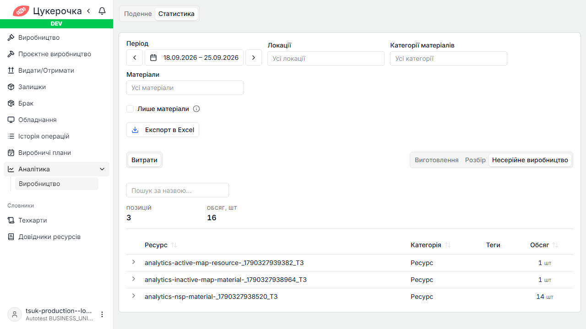
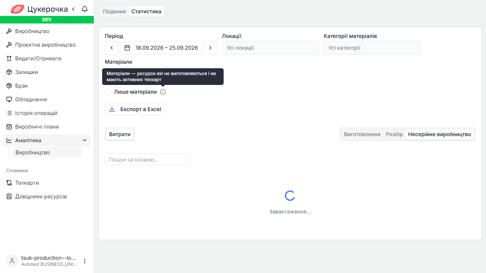
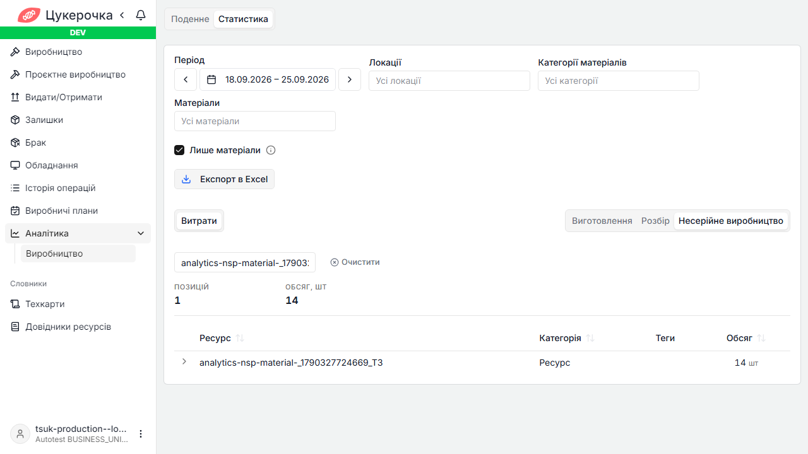

# TC-ANL-UI-012 — Excel враховує «Лише матеріали» і пошук

## Мета

Перевірити, що фільтр «Лише матеріали» та текстовий пошук однаково впливають на таблицю витрат і Excel-експорт.

## Середовище

- Середовище: `dev`.
- Сторінка: `/analytics/production`.
- Представлення автотесту: `Статистика → Витрати → Несерійне виробництво`.
- Користувач має доступ до аналітики виробництва та Excel-експорту.

## Передумови

Створити на тестовій локації завершені операції несерійного виробництва з трьома витратними ресурсами:

1. Матеріал A — не має техкарт.
2. Матеріал B — має лише неактивну техкарту.
3. Ресурс C — має активну техкарту в іншій локації.

У контрольному стані з вимкненим чекбоксом UI відображає всі три ресурси.

## Кроки та очікуваний результат

1. Відкрити `/analytics/production` і перейти до `Статистика → Витрати → Несерійне виробництво`.

   Очікувано: відображаються фільтри витрат, поле пошуку, чекбокс «Лише матеріали» та кнопка «Експорт в Excel».

2. Навести курсор на `InfoIcon` біля чекбокса.

   Очікувано: відображається текст «Матеріали — ресурси які не виготовляються і не мають активних техкарт».

   

3. Увімкнути «Лише матеріали».

   Очікувано:

   - запит витрат містить `rawResources=true`;
   - матеріали A і B залишаються у вибірці;
   - ресурс C з активною техкартою іншої локації не відображається.

4. У полі «Пошук за назвою…» ввести повну назву матеріалу A.

   Очікувано: лічильник дорівнює `1`; UI показує тільки матеріал A; матеріали B і C не відображаються.

   

5. Натиснути «Експорт в Excel» і відкрити завантажений workbook.

   Очікувано:

   - export-запит містить `rawResources=true`;
   - workbook містить матеріал A;
   - workbook не містить матеріал B;
   - workbook не містить ресурс C з активною техкартою;
   - кількість експортованих матеріалів відповідає повній відфільтрованій вибірці, а не лише поточній сторінці таблиці.

## Поточний результат на dev

Статус: **FAILED — відомий дефект Excel-експорту**.

- UI правильно застосовує «Лише матеріали» та пошук: показано одну позицію.
- `rawResources=true` передається до export-запиту, тому ресурс C з активною техкартою виключається.
- Пошуковий текст не передається до export-контракту.
- Workbook містить матеріал B, хоча він прихований пошуком у UI.

## Ручне відтворення на наявних dev-даних

- Період: `01.09.2026–30.09.2026`.
- Представлення: `Статистика → Витрати → Виготовлення`.
- Після ввімкнення «Лише матеріали» у вибірці є 8 позицій, зокрема:
  - `Труба 50мм (каналізаційна)` — `0,44 м`;
  - `Труба 75мм (водостічна)` — `0,44 м`.
- Пошук `Труба 50мм` залишає одну позицію — `Труба 50мм (каналізаційна)`.
- Після експорту workbook має містити трубу 50 мм і не містити трубу 75 мм.

## Автоматизація

- Test case ID: `TC-ANL-UI-012`.
- Метод: `ProductionAnalyticsUiTest.excelExportRespectsOnlyMaterialsAndExpenseSearch()`.
- Severity: `BLOCKER`.
- Критерій проходження: workbook містить пошуковий матеріал і не містить іншого матеріалу або ресурсу з активною техкартою.
